# Provision an Instance of SAP HANA Cloud, SAP HANA Database

<!-- description --> Learn how to provision an instance of SAP HANA Cloud, SAP HANA database using the SAP HANA Cloud Central provisioning wizard.

## You will learn

- How to use the provisioning wizard in SAP HANA Cloud Central to configure and create an SAP HANA Cloud database instance
- How to start and stop your instance
- How to upgrade from a free tier instance to a paid tier instance

## Intro

A few things to keep in mind before you start, particularly if you are using a free tier instance:

- Free tier instances have a **predefined size** of 16 GB memory, 1 vCPU, and 80 GB storage. Production instances allow full customisation.
- Free tier instances are **stopped automatically every night**. You must restart the instance each day before working with it.
- If you do not restart a free tier instance within **30 days**, it will be **deleted**. Your BTP account remains intact and you can re-provision at any time.
- The instance summary card for a free tier instance does **not** show a cost estimate. If you see a cost estimate, you are on a paid tier and charges will apply.

  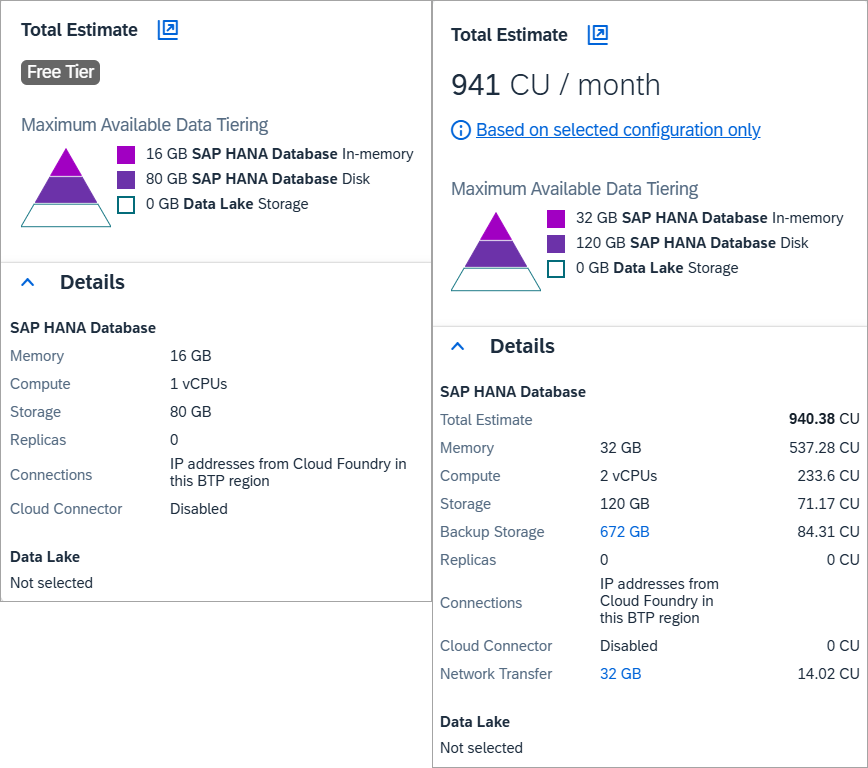

---

## Step 1 — Start the Provisioning Wizard

<!-- ### Free Tier

1. In the SAP BTP cockpit, open **SAP HANA Cloud Central** by clicking on the SAP HANA Cloud subscription in the **Subscriptions** tab. Select **Configure manually**.

   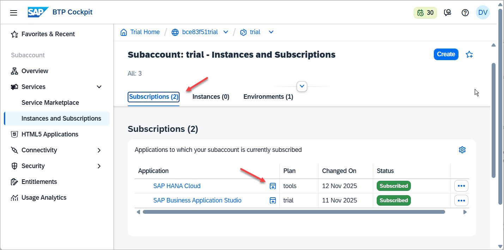

2. In the top-right corner, click **Create Instance**.

   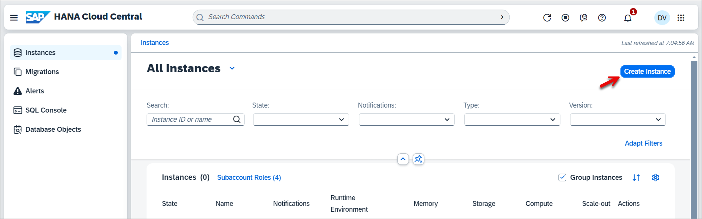

3. Under **Type**, select **SAP HANA Database**.

   > If only one service plan is enabled in your entitlement, the **License** section does not appear and that plan is used automatically.

   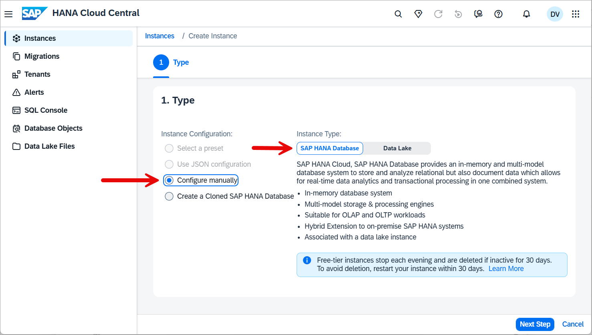

4. Click **Next Step** to continue. -->

### Production

1. In the SAP BTP cockpit, open **SAP HANA Cloud Central** from the **Subscriptions** tab.

   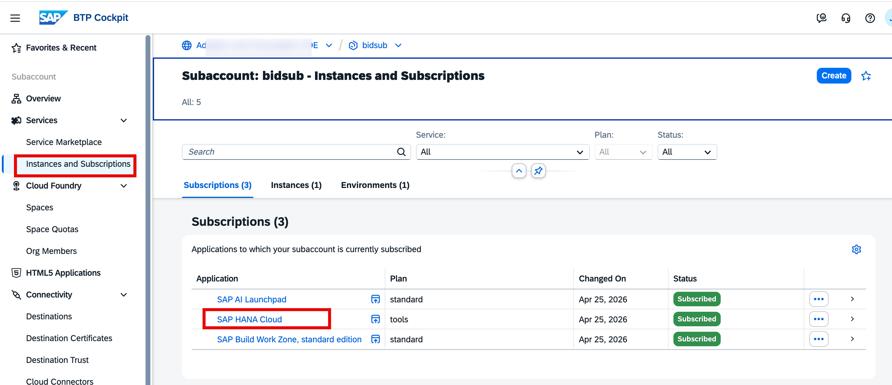

2. In the top-right corner, click **Create Instance**.

   

3. In the **License** section, select **Free Tier** if you want to stay on the free tier model. Select **SAP HANA Database**, then **Configure manually**.

   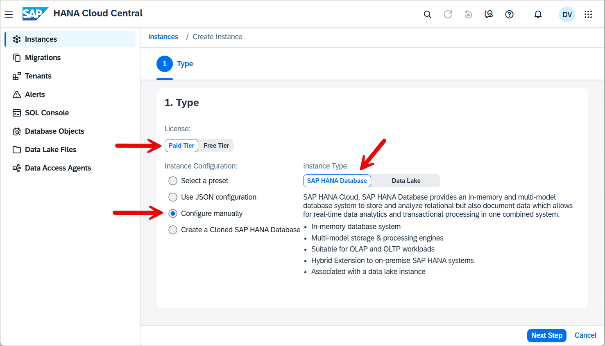

4. Click **Next Step** to continue.

---

## Step 2 — Choose Instance Name and Password

1. In the **Basics** section, enter a name in the **Instance Name** field (e.g. `HC_HDB`).

   > Instance names cannot contain spaces and **cannot be changed** after creation.

2. Enter a strong password in the **Administrator Password** field and confirm it.

   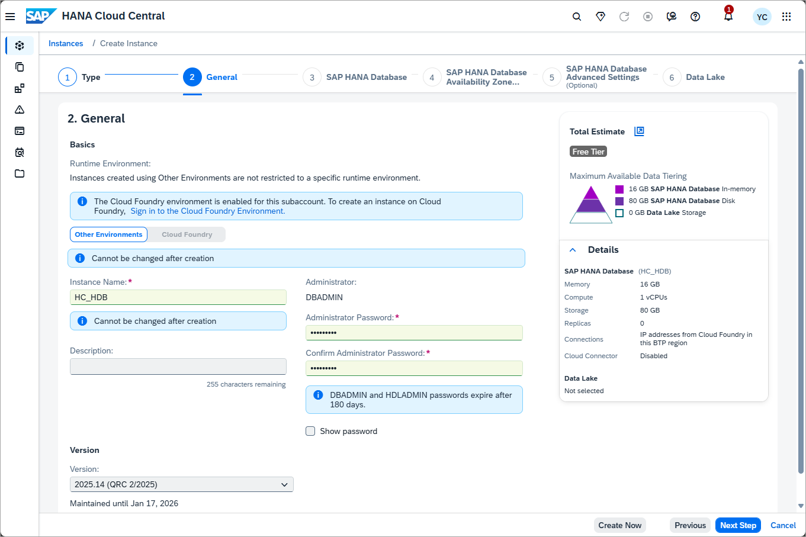

   > This password is for the `DBADMIN` user. It can be reset later via the **Reset DBADMIN Password** action in SAP HANA Cloud Central if you have the SAP HANA Cloud Security Administrator role.

3. Optionally, choose a **Runtime Environment**. See [What Runtime Environment is my SAP HANA Cloud Instance Using?](https://help.sap.com/docs/hana-cloud/sap-hana-cloud-administration-guide/runtime-environments-for-sap-hana-cloud) for details.

4. Click **Next Step** to continue.

---

## Step 3 — Set the Database Size

<!-- ### Free Tier

The size is predefined: **16 GB** memory, **80 GB** storage, **1 vCPU**.

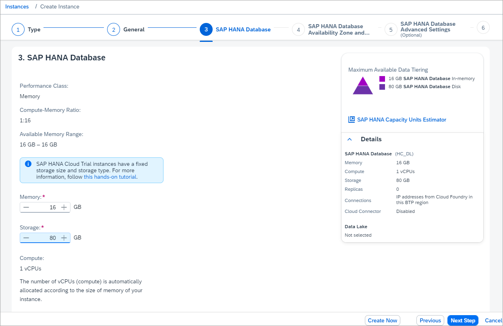

Click **Next Step** to continue. -->

### Production

1. Select a **performance class** and set the initial **Memory** allocation. Compute and storage values adjust automatically.

   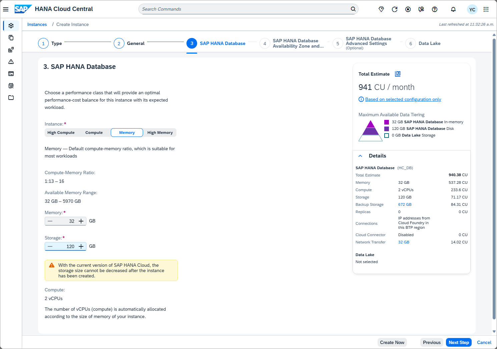

   The **total estimate** in capacity units is shown on the right. See [SAP HANA Database Size](https://help.sap.com/docs/hana-cloud/sap-hana-cloud-administration-guide/sap-hana-database-size) for guidance.

2. Click **Next Step** to continue.

---

## Step 4 — Availability Zone and Replicas

Replicas are exact duplicates of your instance that synchronise automatically in the background. In the event of an issue, you can fail over to a replica to minimise downtime.

<!-- ### Free Tier

Availability zone and replicas are **not supported** for free tier instances.

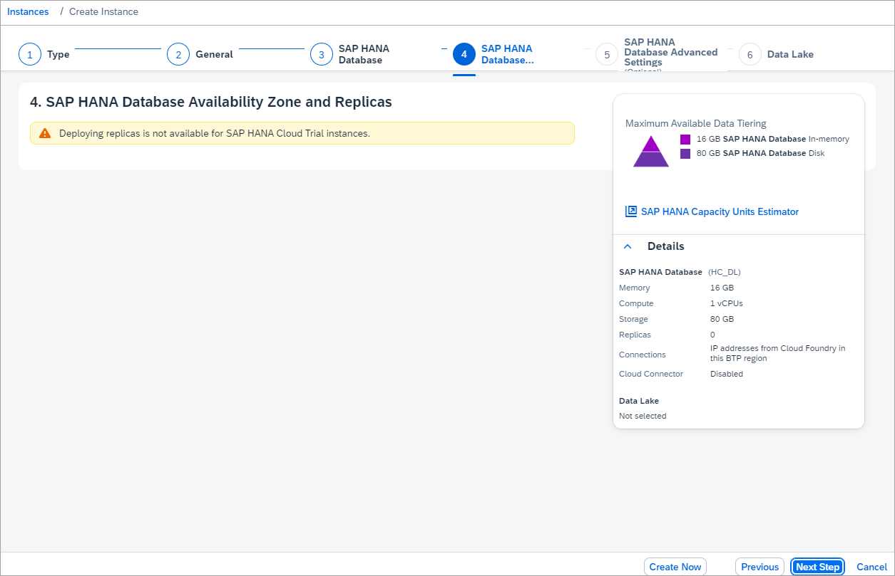

Click **Next Step** to continue. -->

### Production

1. Select an **Availability Zone** and optionally enable a replica.

   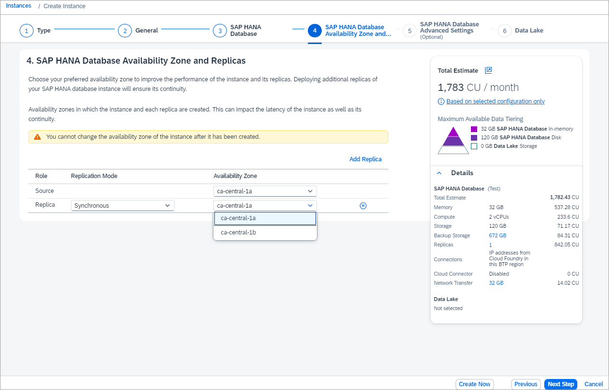

   > The availability zone **cannot be changed** after instance creation. To update replicas, you must delete and re-create them.

2. Click **Next Step** to continue.

---

## Step 5 — Advanced Settings

<!-- ### Free Tier

1. Configure the following optional features as needed:
   - **Predictive Analysis Library (PAL)** — not required for this mission
   - **Data Provisioning Server** — not required for this mission
   - **Allowed Connections** — choose one of:
     - _Allow only BTP IP addresses_ — restricts access to SAP BTP only
     - _Specific IP addresses_ — allows access from nominated IPs
     - _All IP addresses_ — open access (use with caution)
   - **SAP Cloud Connector** — enables connectivity to on-premises SAP HANA databases
   - **Instance Mapping** — maps this instance into a Cloud Foundry runtime; required for CAP and HDI-based development

   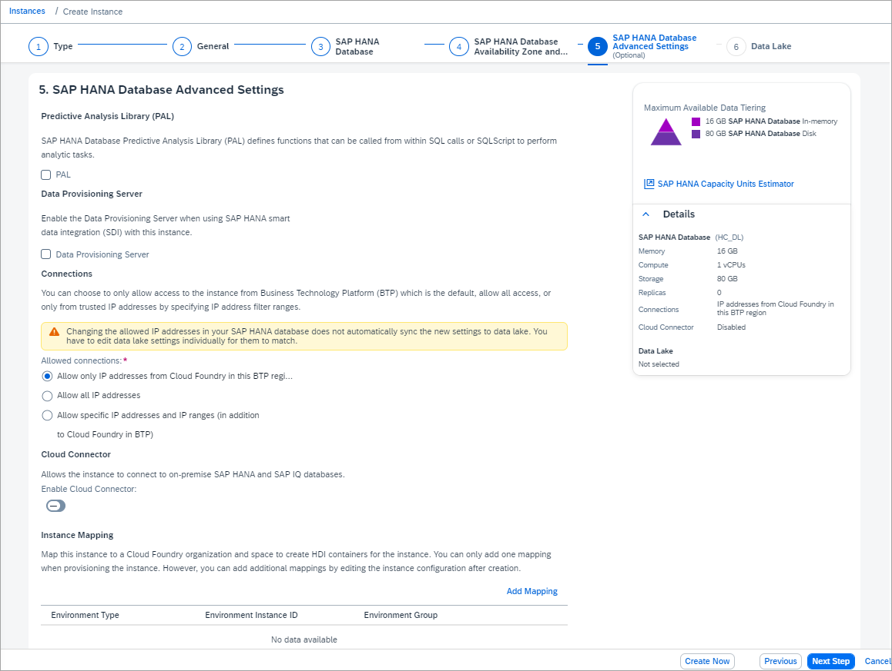

2. Click **Next Step** to continue. -->

### Production

1. Under **Advanced Settings**, optionally enable additional features: **Script Server**, **Document Store**, **Triple Store**, **NLP**, **Data Provisioning Server**.

   > If your instance does not have sufficient vCPUs for a selected feature, click the error link to automatically increase the vCPU count.

   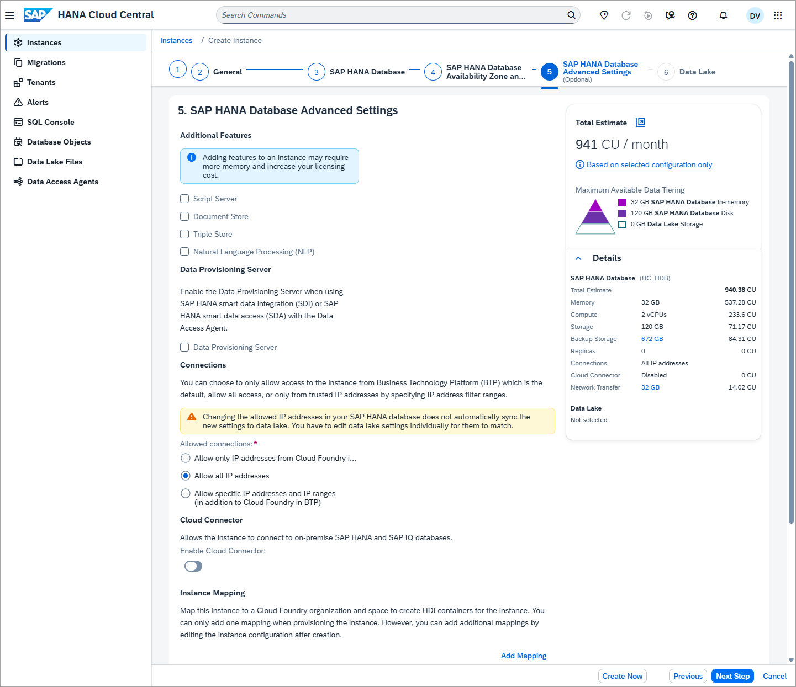

2. Configure **Allowed Connections** and optionally enable the **SAP Cloud Connector**.

3. Configure **Instance Mapping** if you intend to use this instance with Cloud Foundry.
   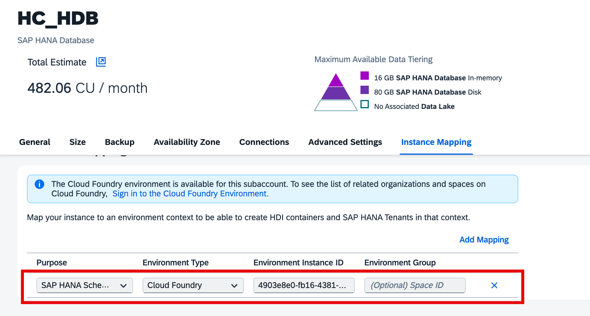

4. Click **Next Step** to continue.

---

## Step 6 — Enable Data Lake (Optional)

Enabling the data lake provisions a managed SAP HANA Cloud, Data Lake alongside your HANA database and automatically creates a remote connection between them.

> Skip this step by clicking **Review and Create** if you do not need a data lake.

<!-- ### Free Tier

1. Click **Create Data Lake**. Two additional wizard steps appear.

   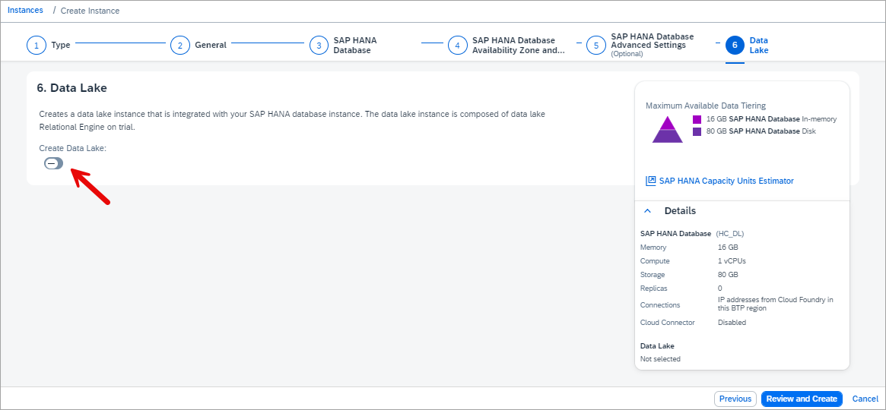

2. Enter a name for the data lake instance.

   > The `HDLADMIN` user is created automatically with the same password as `DBADMIN`. Changing one password later does **not** update the other.

   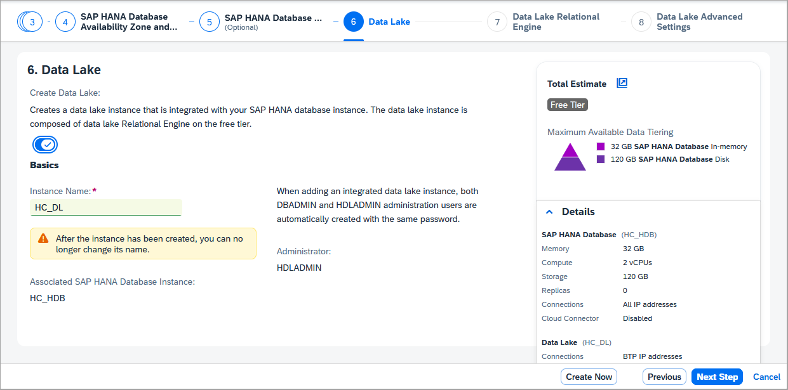

3. The coordinator, worker, and storage sizes are predefined for free tier. Review the values and click **Next Step**.

   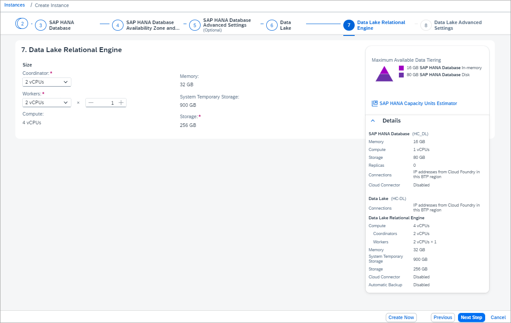

4. Configure **Allowed Connections** for the data lake. Note that backups are not available on free tier.

   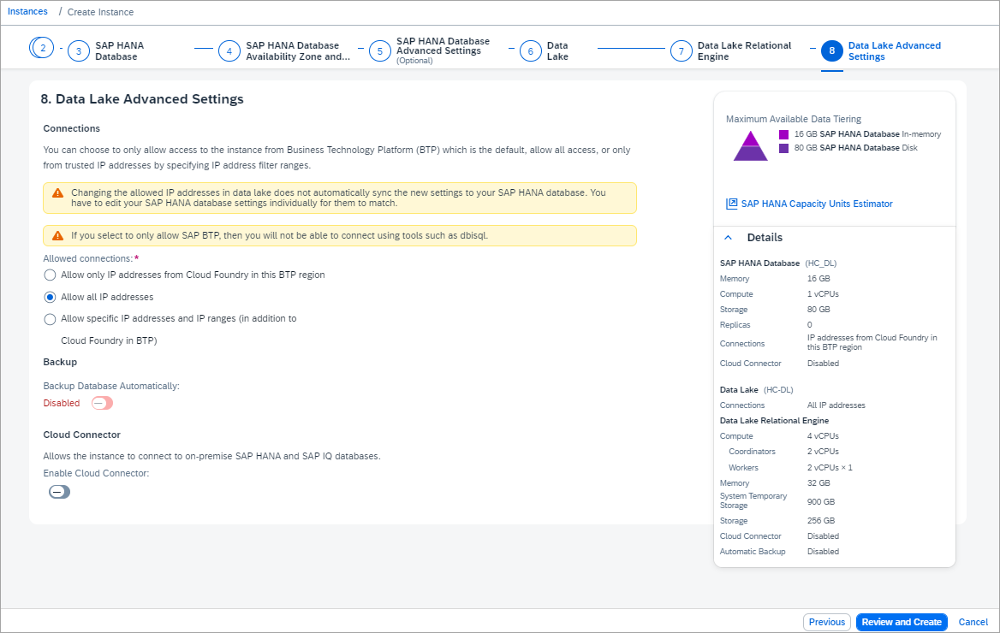

5. Click **Review and Create**, then **Create Instance**.

   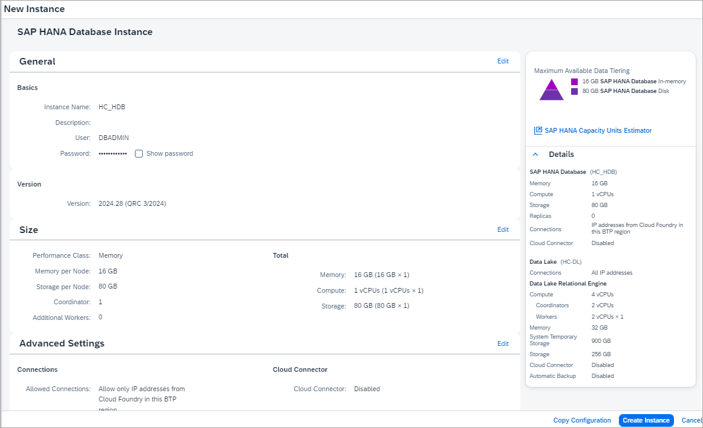 -->

### Production

1. Click **Create data lake**. A managed data lake including a Data Lake Files instance will be provisioned.

   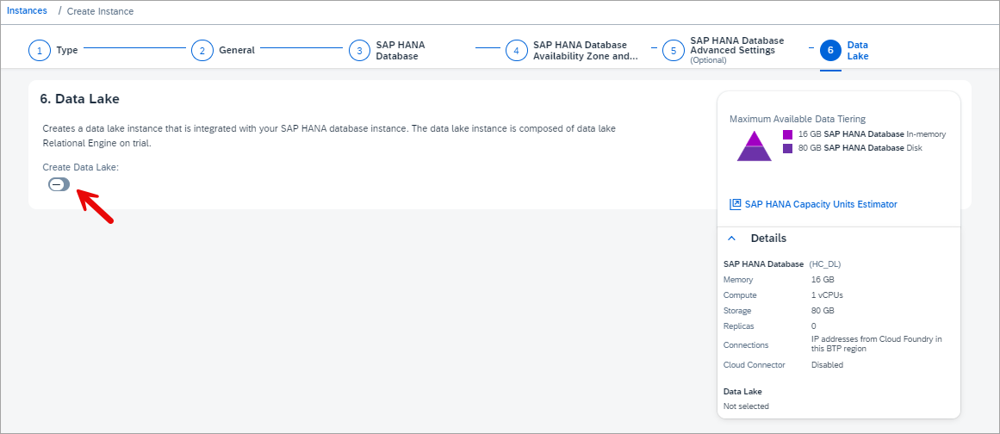

2. Enter an **Instance Name** for the data lake.

   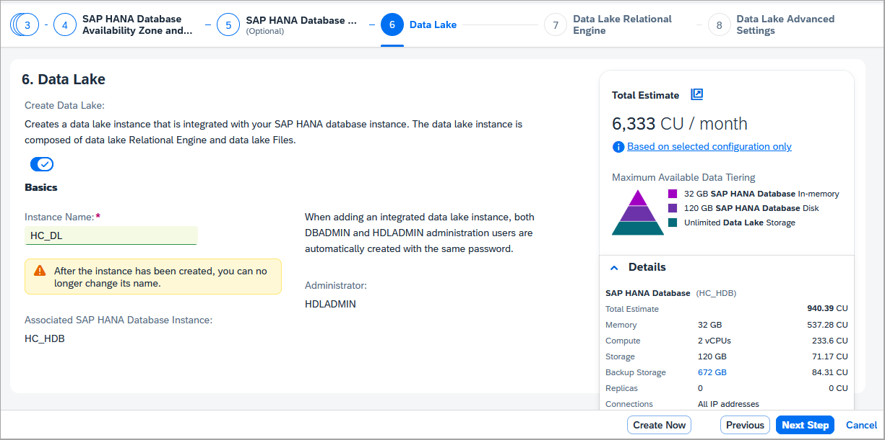

3. Click **Next Step** and configure the number of **coordinators**, **workers**, and **storage** size.

   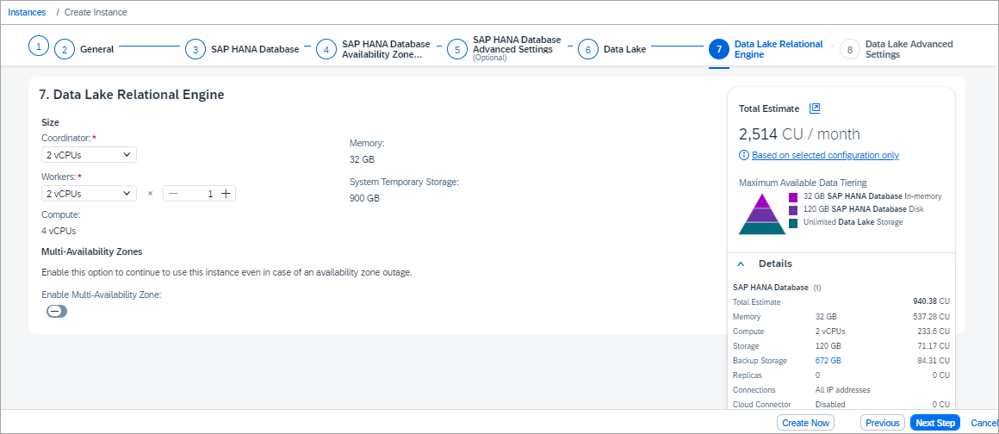

4. Click **Next Step** and configure **Allowed Connections**. You can also copy the IP address settings from your SAP HANA database.

   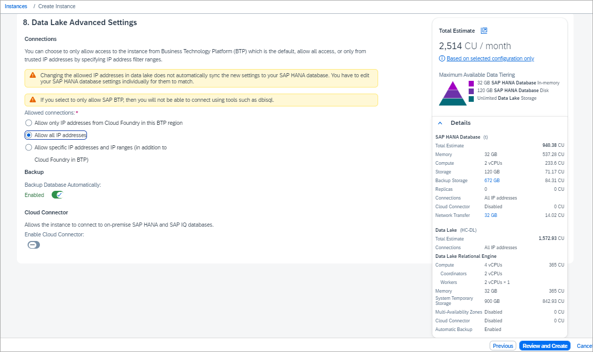

5. Click **Review and Create** to complete provisioning.

---

Your SAP HANA Cloud, SAP HANA database (and optional data lake) instances are now being created. Provisioning typically takes a few minutes. Monitor the status in SAP HANA Cloud Central.

---

## Step 7 — Start and Stop Your Instance

> Free tier instances are stopped automatically every night. You must restart before working with the instance each day.

1. To **stop** an instance: click the three-dots **Actions** menu next to the instance row in SAP HANA Cloud Central and select **Stop**.

   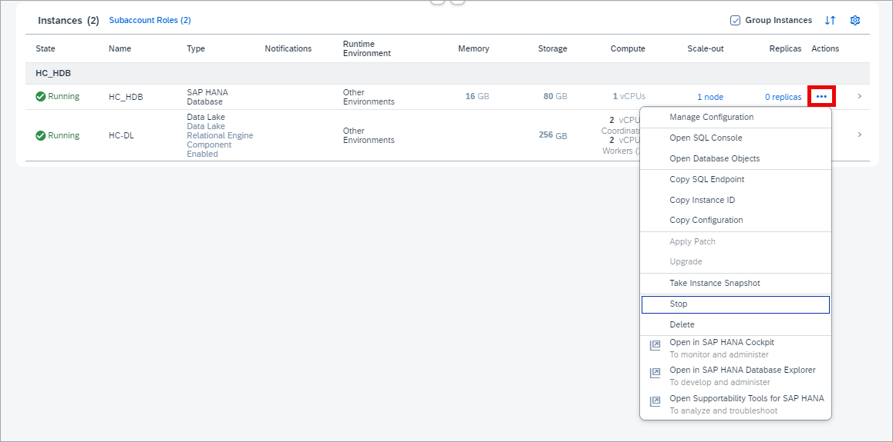

2. To **start** an instance: click **Start** in the same Actions menu. When the instance is ready, it shows **Running** status in SAP HANA Cloud Central and **Created** in the BTP cockpit.

   > Use the **auto-refresh** button to set how frequently the instance list updates automatically.

   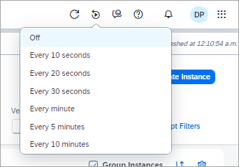

---

<!-- ## Step 8 — Upgrade to Paid Tier (Optional)

When you are ready to move from free tier to paid tier in a productive BTP account:

1. Click the three-dots **Actions** menu next to your SAP HANA Cloud instance in SAP HANA Cloud Central and select **Upgrade to Paid Tier**.

   > The **Upgrade to Paid Tier** option only appears if paid tier plans are enabled in your SAP HANA Cloud entitlement.

   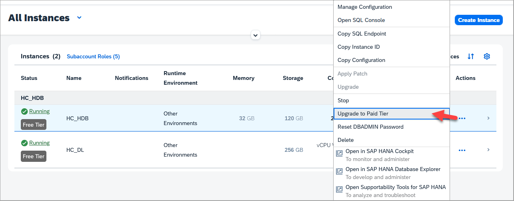

2. A confirmation dialog shows the cost estimate for the paid tier instance. Click **Upgrade to Paid Tier** to proceed.

   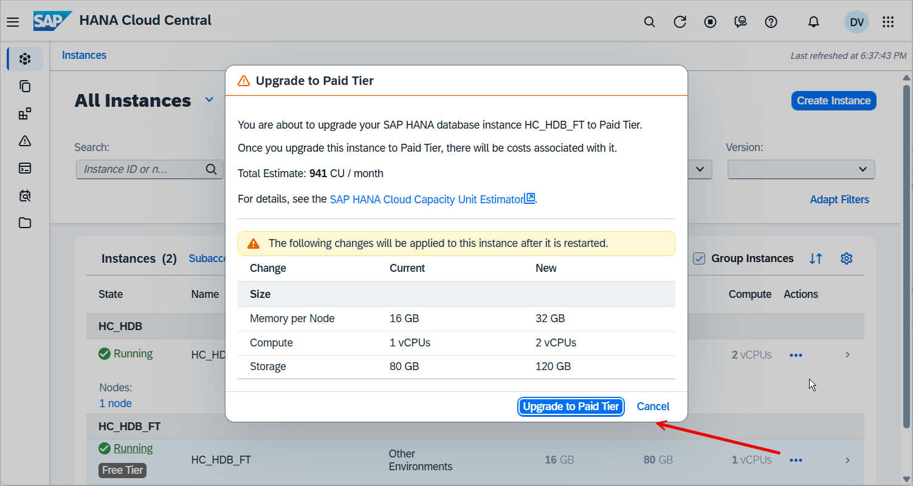 -->

---

## Summary

You have provisioned an SAP HANA Cloud, SAP HANA database instance using the SAP HANA Cloud Central wizard. You know how to start and stop the instance, and how to upgrade to a paid tier when ready. In the next step, you will configure the HANA instance for use with the procurement application.
