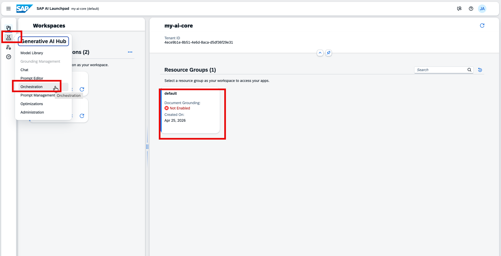
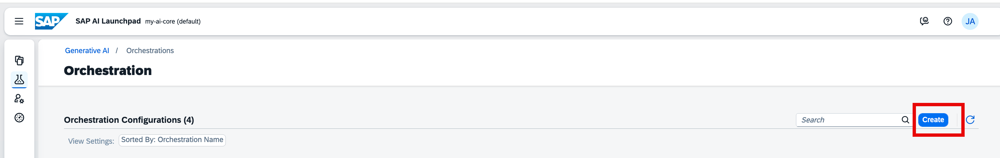
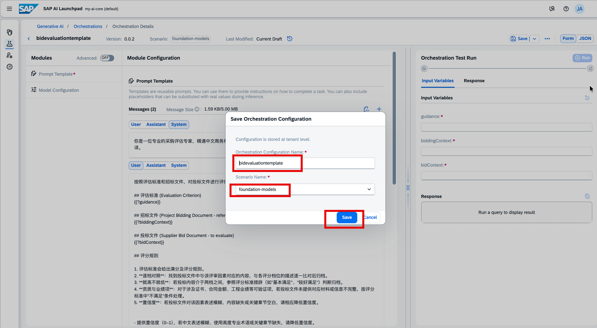

# Configure SAP AI Launchpad: Connection, Resource Group, Model Deployment, and BTP Destination

<!-- description --> Connect SAP AI Launchpad to SAP AI Core using a service key, select a resource group, deploy GPT-5 and a text embedding model from the Model Library, and create a BTP Destination to enable application access to AI Core.

## You will learn

- How to add an SAP AI Core connection in SAP AI Launchpad using service key credentials
- How to select a resource group to scope your AI operations
- How to deploy GPT-5 and a text embedding model via the Generative AI Hub Model Library
- How to create a BTP Destination for SAP AI Core so applications can call the API

<!-- ## Prerequisites

- SAP AI Launchpad subscribed and accessible (see [00-BTP-Initial-Setup](../00-BTP-Initial-Setup/README.md))
- SAP AI Core service instance created with the `extended` plan
- SAP AI Core service key available (JSON credentials from your Cloud Foundry service key binding)

--- -->

## Part 1 — Add a Connection to SAP AI Core

The **Workspaces** app is the entry point for managing connections between SAP AI Launchpad and your SAP AI Core instances.

### Open the Workspaces app

1. Open your **SAP AI Launchpad** subscription URL from the BTP cockpit.

   

2. In the left navigation bar, click **Workspaces**.

3. Click **Add** to create a new connection to your SAP AI Core instance.

   

   

### Fill in the connection details from your service key

4. Enter `my-ai-core` as the **Connection Name**.

5. Open your AI Core service key JSON and map the fields as shown below:

   | AI Launchpad field     | Service key field             |
   | ---------------------- | ----------------------------- |
   | **AI API URL**         | `serviceurls.AI_API_URL`      |
   | **Authentication URL** | `url` (append `/oauth/token`) |
   | **Client ID**          | `clientid`                    |
   | **Client Secret**      | `clientsecret`                |

   

   <!--  -->

   

   

6. Click **Create** to save the connection.

> **Tip:** If a connection already exists in your workspace, you can add another one under a different name. SAP AI Launchpad supports multiple concurrent connections to different AI Core instances.

---

## Part 2 — Select a Resource Group

Resource groups isolate AI assets (configurations, deployments, artifacts) within a single AI Core instance. Selecting one in the header scopes all subsequent operations to that group.

### Connect to your AI Core instance

7. In the **Workspaces** app, click on `my-ai-core`. The connection name appears in the top header and additional apps — including **Generative AI Hub** — become available in the left navigation.

   

   <!--  -->

### Select the resource group

8. In the **Resource Groups** pane on the left, select `default`.

   The selected resource group is reflected in the header. All configurations, deployments, and model access are now scoped to this group.

   

> **Note:** The `default` resource group is created automatically during SAP AI Core provisioning. For a dedicated resource group for this procurement use case, create one via **SAP AI Core Administration** and select it here.

---

## Part 3 — Deploy GPT-5

SAP AI Core's **Generative AI Hub** provides a Model Library where you can deploy foundation models with a single click — no configuration file required.

### Deploy from the Model Library

9. In the left navigation, go to **Generative AI Hub** → **Model Library**.

   

10. Locate **GPT-4o** and click **Deploy**.

    

### Verify the deployment is running

11. Go to **ML Operations** → **Deployments** to monitor the deployment status.

    Wait until the **Status** column shows **Running** before proceeding.

    

---

## Part 4 — Deploy Text Embedding Model

Repeat the same process to deploy a text embedding model, which is required for vector search and semantic retrieval in the procurement evaluation use case.

### Deploy from the Model Library

12. In the left navigation, go to **Generative AI Hub** → **Model Library**.

    

13. Locate the **text embedding** model and click **Deploy**.

    

### Verify the deployment is running

14. Go to **ML Operations** → **Deployments** and confirm the text embedding deployment **Status** is **Running**.

    

> **Note:** Both the GPT-4o and text embedding deployments must have **Running** status before they can be consumed by applications.

---

## Part 5 — Create a BTP Destination for SAP AI Core

BTP applications communicate with SAP AI Core through the **Destination** service, which handles OAuth2 token exchange automatically. In this part, you create a destination named `bid-aicore` so that your procurement application can call the AI Core API without managing credentials directly.

### Retrieve the AI Core service key credentials

15. In the BTP cockpit, navigate to your subaccount → **Services** → **Instances and Subscriptions**.

16. Locate your SAP AI Core service instance, click the **⋮** (Actions) icon, and select **View Credentials**.

    

    

    Keep this panel open. You will copy four values from the JSON into the destination form:

    | Destination field | Service key field        |
    | ----------------- | ------------------------ |
    | URL               | `serviceurls.AI_API_URL` |
    | Client ID         | `clientid`               |
    | Client Secret     | `clientsecret`           |
    | Token Service URL | `url` + `/oauth/token`   |

### Create the destination

17. In the left navigation of your BTP subaccount, go to **Connectivity** → **Destinations**.

18. Click **New Destination**.

    

19. Fill in the destination properties as follows:

    | Field                 | Value                                |
    | --------------------- | ------------------------------------ |
    | **Name**              | `bid-aicore`                         |
    | **Type**              | `HTTP`                               |
    | **Description**       | `bid-aicore`                         |
    | **URL**               | `<AI_API_URL from service key>`      |
    | **Proxy Type**        | `Internet`                           |
    | **Authentication**    | `OAuth2ClientCredentials`            |
    | **Client ID**         | `<clientid from service key>`        |
    | **Client Secret**     | `<clientsecret from service key>`    |
    | **Token Service URL** | `<url from service key>/oauth/token` |

    

20. Click **Save**, then click **Check Connection**.

    A `200 OK` response confirms the destination is correctly configured and can reach the AI Core API. If you receive an error, verify that the Token Service URL ends with `/oauth/token` and that the client credentials match the service key exactly.

## Part 6 — Create an Orchestration Prompt Template

The **Orchestration** feature in SAP Generative AI Hub lets you define reusable prompt templates with named input variables. In this part, you create a template called `bidevaluationtemplate` that the procurement application will call at runtime to evaluate supplier bids against tender criteria.

### Open the Orchestration app

21. In the left navigation, expand **Generative AI Hub** and click **Orchestration**.

    

22. On the **Orchestration** page, click **Create**.

    

### Configure the prompt template

23. In the **Orchestration Details** editor, expand the **Prompt Template** module. Add two messages:
    - **System** message — sets the model's role as a procurement evaluation expert:

      ```
      你是一位专业的采购评估专家，精通中文商务和技术文件。以下所有内容均以中文撰写，请直接以中文进行分析，无需翻译。
      ```

    - **User** message — defines the evaluation task and scoring rules, using three input variables (`{{?guidance}}`, `{{?biddingContext}}`, `{{?bidContext}}`):

      ```
      按照评估标准和招标文件，对投标文件进行评估打分。

      ## 评估标准 (Evaluation Criterion)
      {{?guidance}}

      ## 招标文件 (Project Bidding Document - reference requirements)
      {{?biddingContext}}

      ## 投标文件 (Supplier Bid Document - to evaluate)
      {{?bidContext}}

      ## 评分规则

      1. 评估标准会给出满分及评分规则。
      2. **逐档对照**：找到投标文件中与该评审因素对应的内容，与各评分档位的描述逐一比对后归档。
      3. **就高不就低**：若投标内容介于两档之间，参照评分标准措辞（如”基本满足”、”较好满足”）判断归档。
      4. **资质与业绩项**：对于涉及证书、合同金额、工程业绩等可验证项，若投标文件未提供对应材料或信息不完整，按评分标准中”不满足”条件处理。
      5. **置信度**：若投标文件对该因素表述模糊、内容缺失或关键章节空白，请相应降低置信度。

      - 提供置信度（0–1），若中文表述模糊、使用高度专业术语或关键章节缺失，请降低置信度。
      - 用中文撰写2–4句简洁说明，阐述评分理由，并引用投标文件中的关键中文原文作为佐证。
      - 满分 从 评估标准 得到，如缺失，按100分算。
      - 仅输出以下格式的JSON对象，不得包含其他内容：
      {“score”: <按该因素评分档位实际得分数字>,”fullscore”:<满分> “confidence”: <0-1>, “explanation”: “<text in Chinese>”}
      ```

### Save the orchestration configuration

24. Click **Save**. In the **Save Orchestration Configuration** dialog:
    - Set **Orchestration Configuration Name** to `bidevaluationtemplate`.
    - Set **Scenario Name** to `foundation-models`.

    Click **Save** to confirm.

    

> **Note:** The three input variables — `guidance`, `biddingContext`, and `bidContext` — are injected at runtime by the procurement application. The `{{?variableName}}` syntax marks them as optional placeholders; the application must supply all three for a complete evaluation.

---

## Summary

You have completed the full SAP AI Launchpad configuration for this use case:

| Step                      | What was configured                                                                                            |
| ------------------------- | -------------------------------------------------------------------------------------------------------------- |
| Connection                | SAP AI Launchpad connected to SAP AI Core via service key (`my-ai-core`)                                       |
| Resource Group            | `default` resource group selected to scope all operations                                                      |
| GPT-4o deployment         | Deployed and running in the Generative AI Hub — ready for chat and reasoning tasks                             |
| Text embedding deployment | Deployed and running — ready for vector search and semantic retrieval                                          |
| BTP Destination           | `bid-aicore` destination created — applications can now call the AI Core API using OAuth2                      |
| Orchestration template    | `bidevaluationtemplate` created — procurement application can now invoke structured bid evaluation via AI Core |
