# Integrate SAP S/4HANA Cloud with SAP BTP and Expose the Business Partner API

<!-- description --> Configure a Communication Arrangement in SAP S/4HANA Cloud to expose the Business Partner OData API (`API_BUSINESS_PARTNER`), then create a Destination in your SAP BTP subaccount to consume it from Cloud Foundry applications.

## What You Will Learn

- How to create a **Communication System** in SAP S/4HANA Cloud that represents your BTP subaccount
- How to create a **Communication Arrangement** for scenario `SAP_COM_0008` (Business Partner, Customer and Supplier Integration)
- How to configure an **HTTP Destination** in SAP BTP to authenticate against the Business Partner OData V2 API

## Prerequisites

- SAP S/4HANA Cloud tenant with administrator access
- SAP BTP subaccount with the **Destination** service entitled and a `dev` Cloud Foundry space available

---

## Part 1 — Create a Communication System in SAP S/4HANA Cloud

A Communication System identifies the external system — in this case your BTP subaccount — that S/4HANA Cloud will accept inbound calls from. You will create one system and attach a dedicated inbound communication user to it.

### Step 1.1 — Open the Communication Systems app

1. Log in to your SAP S/4HANA Cloud tenant as an administrator.
2. Open the **SAP Fiori Launchpad** and search for the app **Communication Systems**.
3. Click **New**. A dialog appears prompting for the System ID and System Name.

   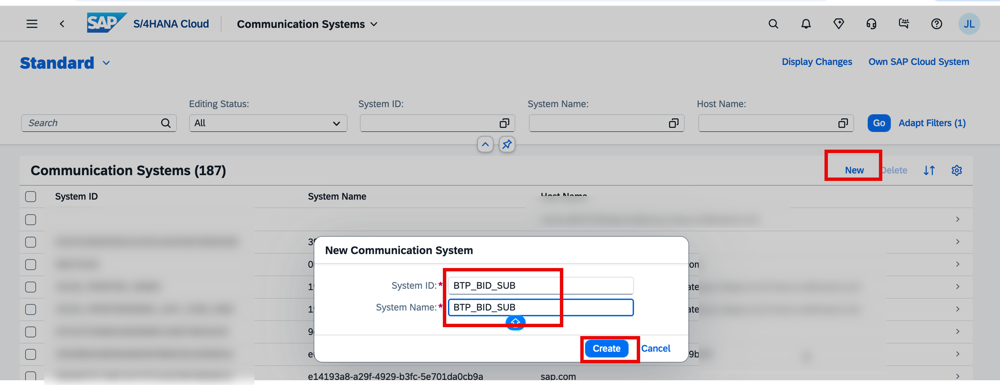

4. Enter the following values, then click **Create**:

   | Field           | Value         |
   | --------------- | ------------- |
   | **System ID**   | `BTP_BID_SUB` |
   | **System Name** | `BTP_BID_SUB` |

### Step 1.2 — Configure General and Technical Data

5. The system record opens. On the **General** tab, locate the **Technical Data** section.
6. Check the **Inbound Only** checkbox. This restricts the system to accepting inbound calls only, which is the correct setup for a BTP consumer.

   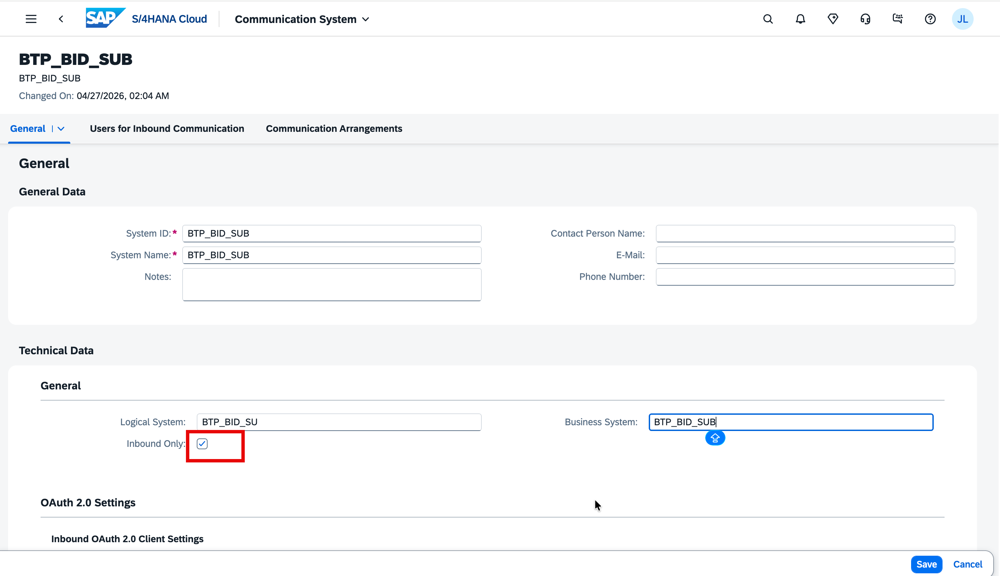

### Step 1.3 — Add an Inbound Communication User

7. Scroll down to the **Users for Inbound Communication** section and click **+**.
8. Select **New User**. The **Create Communication User** screen opens.
9. Enter a **User Name** (e.g. `BID_INBOUND`) and click **Propose Password** to generate a strong password.

   > **Important:** Copy the proposed password before saving — it is displayed only once and will be needed when configuring the BTP Destination in Part 3.

   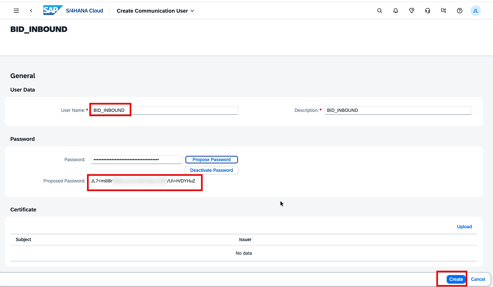

10. Click **Create** to save the user.
11. You are returned to the Communication System. The new user appears in the **Users for Inbound Communication** table with authentication method **User ID and Password**.

    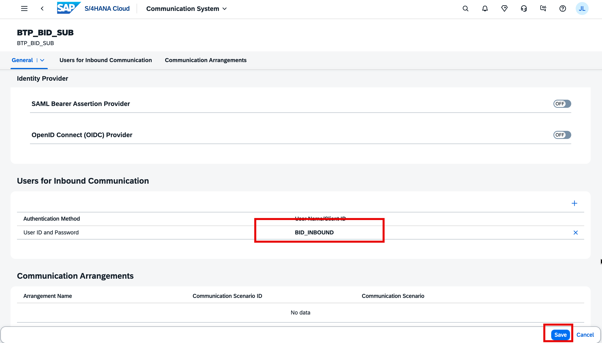

12. Click **Save**.

---

## Part 2 — Create a Communication Arrangement for the Business Partner API

A Communication Arrangement activates a specific integration scenario and links it to the Communication System you created in Part 1. The scenario `SAP_COM_0008` exposes all Business Partner, Customer, and Supplier APIs.

### Step 2.1 — Open the Communication Arrangements app

1. From the SAP Fiori Launchpad, open the app **Communication Arrangements**.
2. Click **New**. A creation dialog appears.

### Step 2.2 — Select the Scenario and Name the Arrangement

3. In the **Scenario** field, enter `SAP_COM_0008` and select **Business Partner, Customer and Supplier Integration**.
4. In the **Arrangement Name** field, enter `BID_SAP_COM_0008`.
5. Click **Create**.

   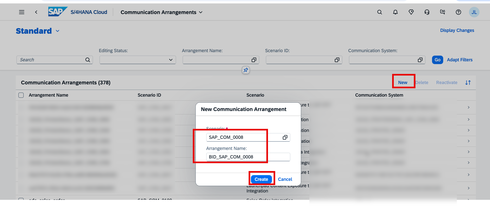

### Step 2.3 — Bind the Communication System

6. In the **Common Data** section, set the **Communication System** field to `BTP_BID_SUB` (the system created in Part 1).

   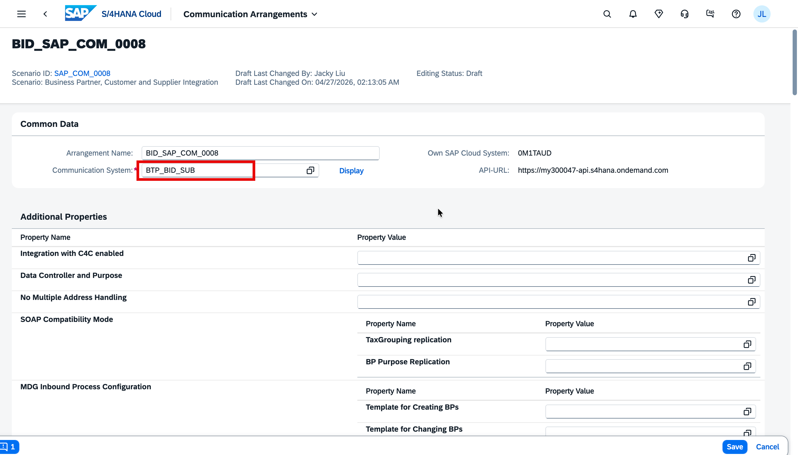

### Step 2.4 — Note the Business Partner API URL

7. Scroll down to the **Inbound Services** table. Locate the row for **Business Partner (A2X)** with protocol **OData V2** and copy its **Service URL/Service Interface** value. It follows this pattern:

   ```
   https://<tenant>-api.s4hana.ondemand.com/sap/opu/odata/sap/API_BUSINESS_PARTNER
   ```

   You will use this URL (the host part only) when creating the BTP Destination.

   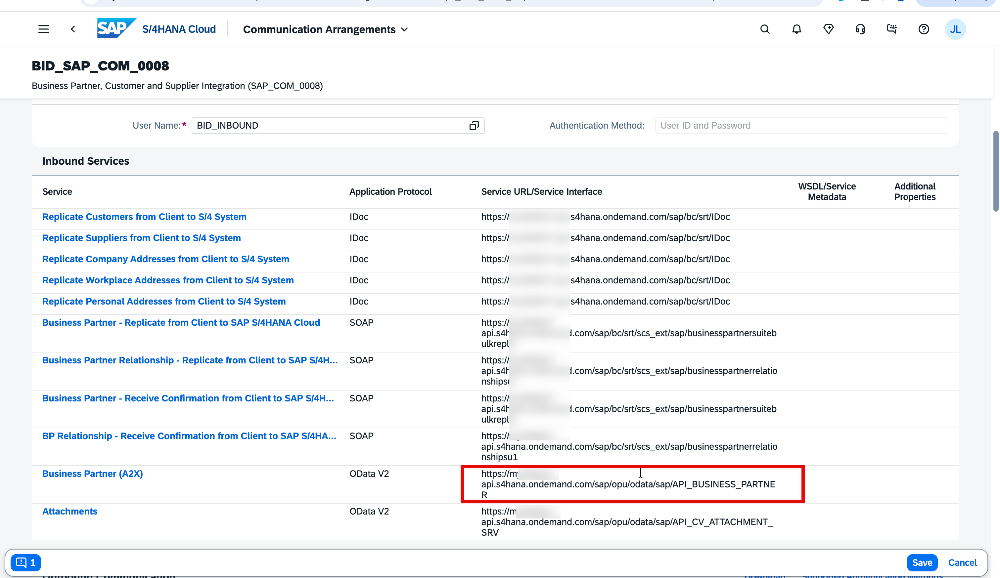

### Step 2.5 — Deactivate Outbound Services

8. Scroll further down to the **Outbound Services** section. For each outbound service listed, uncheck the **Active** checkbox. This prevents unnecessary outbound replication jobs from being triggered.

   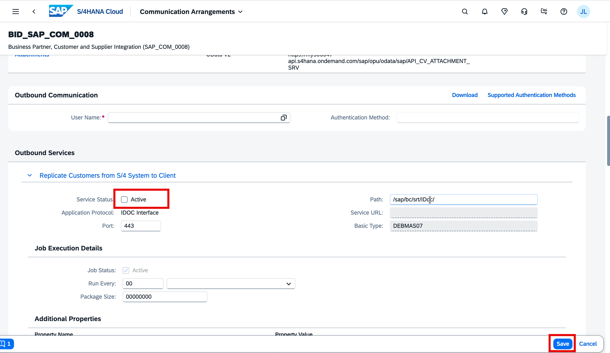

9. Click **Save**.

---

## Part 3 — Create a Destination in SAP BTP

With the S/4HANA Cloud side configured, create an HTTP Destination in your BTP subaccount so that Cloud Foundry applications can reach the Business Partner API using the Destination service.

### Step 3.1 — Open the Destination Editor

1. Go to your SAP BTP subaccount in the [BTP Cockpit](https://cockpit.btp.cloud.sap).
2. In the left navigation, go to **Connectivity** → **Destinations**.
3. Click **Create** (or **New Destination**).

### Step 3.2 — Configure Main Properties and Authentication

4. Fill in the destination properties as follows:

   | Field              | Value                                                                                |
   | ------------------ | ------------------------------------------------------------------------------------ |
   | **Name**           | `S4_BP`                                                                              |
   | **Type**           | `HTTP`                                                                               |
   | **Description**    | `S4HC Business Partner`                                                              |
   | **URL**            | The host from the Communication Arrangement URL, e.g. `https://<tenant>-api.s4hana.ondemand.com` |
   | **Proxy Type**     | `Internet`                                                                           |
   | **Authentication** | `BasicAuthentication`                                                                |
   | **User**           | `BID_INBOUND` (the inbound communication user created in Step 1.3)                   |
   | **Password**       | The password you saved in Step 1.3                                                   |

   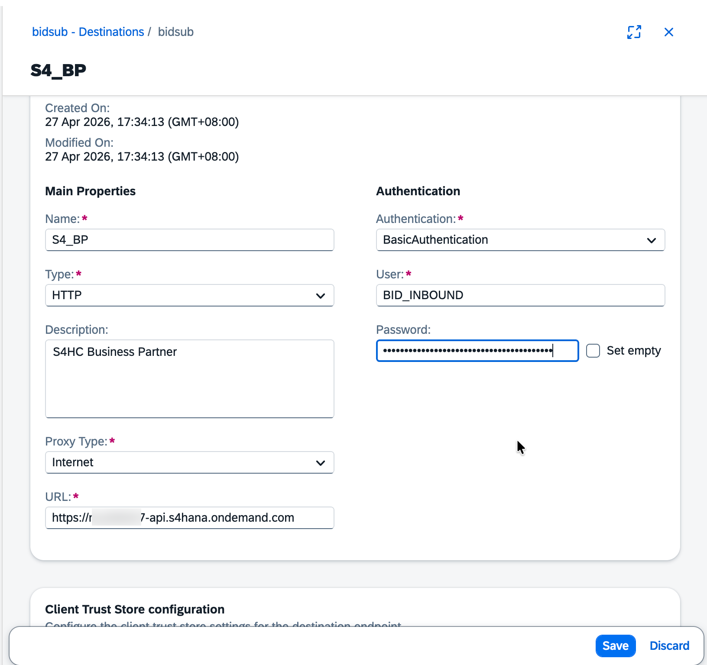

### Step 3.3 — Add Additional Properties

5. Under **Additional Properties**, click **Add Property** and add the following two entries:

   | Key                        | Value                                         |
   | -------------------------- | --------------------------------------------- |
   | `sap-client`               | Your S/4HANA Cloud client number (e.g. `100`) |
   | `HTML5.DynamicDestination` | `true`                                        |

   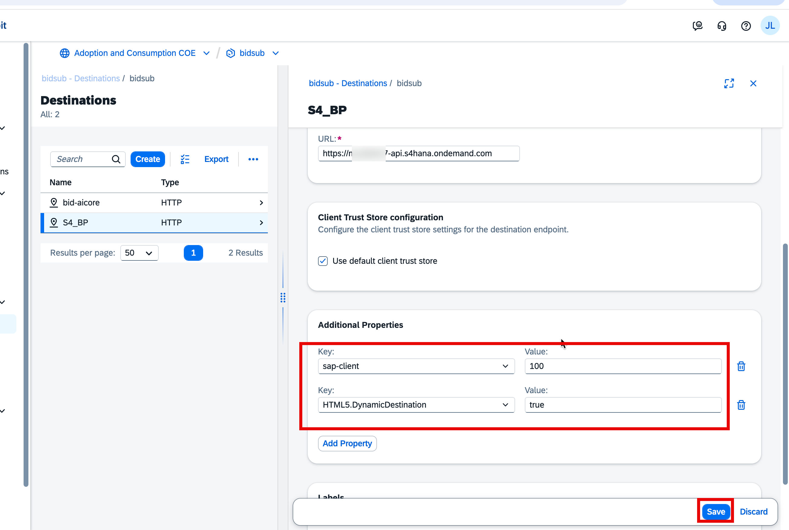

6. Click **Save**.

### Step 3.4 — Test the Connection

7. Click **Check Connection**. A pop-up confirms **HTTP request (without authentication) to S4_BP destination succeeded**, which means connectivity from your BTP subaccount to S/4HANA Cloud is working correctly.

   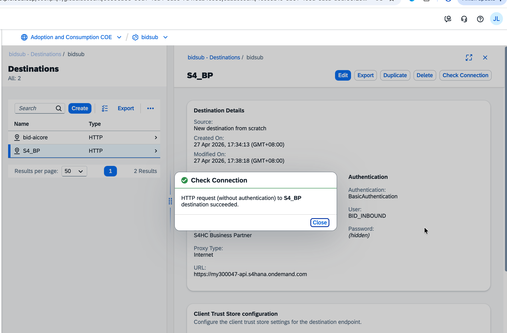

---

## Summary

You have completed the full integration between SAP S/4HANA Cloud and SAP BTP:

| What you created | Where | Purpose |
| --- | --- | --- |
| Communication System `BTP_BID_SUB` | SAP S/4HANA Cloud | Identifies the BTP subaccount as a trusted inbound caller |
| Communication User `BID_INBOUND` | SAP S/4HANA Cloud | Provides credentials for inbound Basic Authentication |
| Communication Arrangement `BID_SAP_COM_0008` | SAP S/4HANA Cloud | Activates the Business Partner API for inbound access |
| Destination `S4_BP` | SAP BTP | Allows CF applications to call `API_BUSINESS_PARTNER` via the Destination service |

Applications running in your BTP Cloud Foundry space can now use the Destination service to call the Business Partner OData V2 API. The host is:

```
https://<tenant>-api.s4hana.ondemand.com
```

The API path (`/sap/opu/odata/sap/API_BUSINESS_PARTNER`) is appended by the application at runtime.
