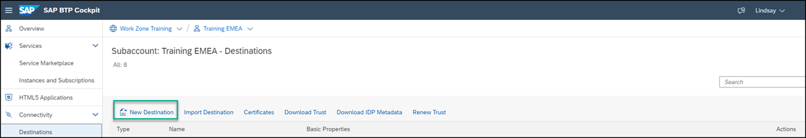
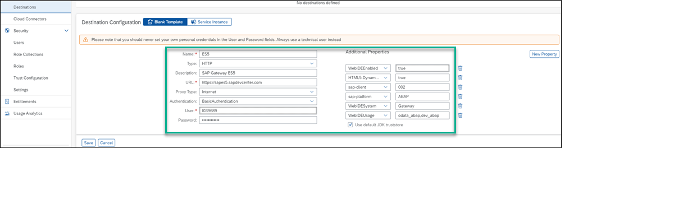
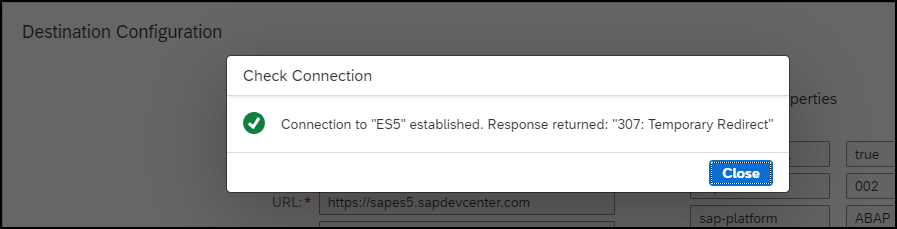

# Integrate SAP S/4HANA Cloud with SAP BTP and Expose Business Partner API

<!-- description --> Configure a Communication Arrangement in SAP S/4HANA Cloud to expose the Business Partner OData API, then create a Destination in your SAP BTP subaccount to consume it.

## You will learn

- How to create a Communication System in SAP S/4HANA Cloud pointing to your BTP subaccount
- How to create a Communication Arrangement for the Business Partner integration scenario (`SAP_COM_0008`)
- How to configure a Destination in SAP BTP to consume the Business Partner OData API

## Prerequisites

- SAP S/4HANA Cloud tenant with administrator access
- SAP BTP subaccount set up (see [00-BTP-Initial-Setup](../00-BTP-Initial-Setup/README.md))
- SAP BTP subaccount has the **Destination** service entitled and a `dev` Cloud Foundry space available

> **Note on screenshots:** Images for Part 3 (BTP Destination) are included in `img/`. Images for Parts 1 and 2 (S/4HANA Cloud Communication Systems and Communication Arrangements Fiori apps) need to be captured from your S/4HANA Cloud tenant and saved to `img/` using the filenames referenced below.

---

## Part 1 — Create a Communication System in SAP S/4HANA Cloud

A Communication System represents the external system (your BTP subaccount) that S/4HANA Cloud will communicate with.

### Open the Communication Systems app

1. Log in to your SAP S/4HANA Cloud tenant as an administrator.

2. Open the **SAP Fiori Launchpad** and search for the app **Communication Systems**.

3. Click **New** to create a new communication system.

<!-- border -->

### Configure the Communication System

4. Enter the following values:

   | Field | Value |
   |---|---|
   | **System ID** | `BTP_SUBACCOUNT` |
   | **System Name** | `SAP BTP Subaccount` |

5. Click **Create**.

6. Under **General** tab, set the **Host Name** to your BTP subaccount API endpoint, for example:
   ```
   <subaccount-subdomain>.authentication.<region>.hana.ondemand.com
   ```

<!-- border -->

7. Scroll down to the **Users for Inbound Communication** section. Click **+** to add a new user.

8. Select **New User** and provide a username and password for the inbound communication user (e.g. `BTP_INBOUND`). Note these credentials — they will be used in the BTP Destination configuration.

<!-- border -->

9. Click **Save**.

---

## Part 2 — Create a Communication Arrangement for Business Partner API

The Communication Arrangement activates a specific integration scenario and links it to the Communication System you created above.

### Open the Communication Arrangements app

1. From the SAP Fiori Launchpad, open the app **Communication Arrangements**.

2. Click **New**.

<!-- border -->

### Select the Business Partner scenario

3. In the **Scenario** field, click the value help and search for:
   ```
   SAP_COM_0008
   ```
   Select **Business Partner, Customer and Supplier Integration** (`SAP_COM_0008`).

<!-- border -->

4. In the **Arrangement Name** field, enter:
   ```
   BUSINESS_PARTNER_BTP
   ```

5. Click **Create**.

### Bind the Communication System

6. In the **Communication System** field, select the system you created in Part 1: `BTP_SUBACCOUNT`.

<!-- border -->

7. Under **Inbound Communication**, confirm the authentication method is **User ID and Password**.

8. Note the **Service URL / Service Interface** shown under **Inbound Communication**. It will be in the form:
   ```
   https://<tenant>.s4hana.ondemand.com/sap/opu/odata/sap/API_BUSINESS_PARTNER
   ```
   Copy this URL — you will need it when configuring the BTP Destination.

<!-- border -->

9. Click **Save**.

---

## Part 3 — Create a Destination in SAP BTP

Now configure the BTP Destination service so applications in your BTP subaccount can call the Business Partner OData API.

### Open the BTP Cockpit

1. Go to your SAP BTP subaccount in the [BTP Cockpit](https://cockpit.btp.cloud.sap).

2. In the left navigation, go to **Connectivity** → **Destinations**.

3. Click **New Destination**.

<!-- border -->

### Configure the Destination

4. Enter the following values:

   | Field | Value |
   |---|---|
   | **Name** | `S4HANA_BUSINESS_PARTNER` |
   | **Type** | `HTTP` |
   | **Description** | `S/4HANA Cloud Business Partner API` |
   | **URL** | The service URL copied from the Communication Arrangement, e.g. `https://<tenant>.s4hana.ondemand.com/sap/opu/odata/sap/API_BUSINESS_PARTNER` |
   | **Proxy Type** | `Internet` |
   | **Authentication** | `BasicAuthentication` |
   | **User** | The inbound communication user created in Part 1, e.g. `BTP_INBOUND` |
   | **Password** | The password set for that user |

<!-- border -->

5. Under **Additional Properties**, click **New Property** and add:

   | Property | Value |
   |---|---|
   | `sap-client` | Your S/4HANA Cloud client number (e.g. `100`) |
   | `HTML5.DynamicDestination` | `true` |

6. Click **Save**.

### Test the connection

7. Click **Check Connection**. A `200 OK` response confirms the destination is correctly configured and the Business Partner API is reachable from your BTP subaccount.

<!-- border -->

---

## Summary

You have:

- Created a **Communication System** in SAP S/4HANA Cloud representing your BTP subaccount
- Created a **Communication Arrangement** for scenario `SAP_COM_0008` to expose the Business Partner OData API (`API_BUSINESS_PARTNER`)
- Configured a **BTP Destination** (`S4HANA_BUSINESS_PARTNER`) to consume that API from your BTP subaccount

Applications running in your BTP Cloud Foundry space can now use the Destination service to call the Business Partner OData V2 endpoint:
```
/sap/opu/odata/sap/API_BUSINESS_PARTNER
```
