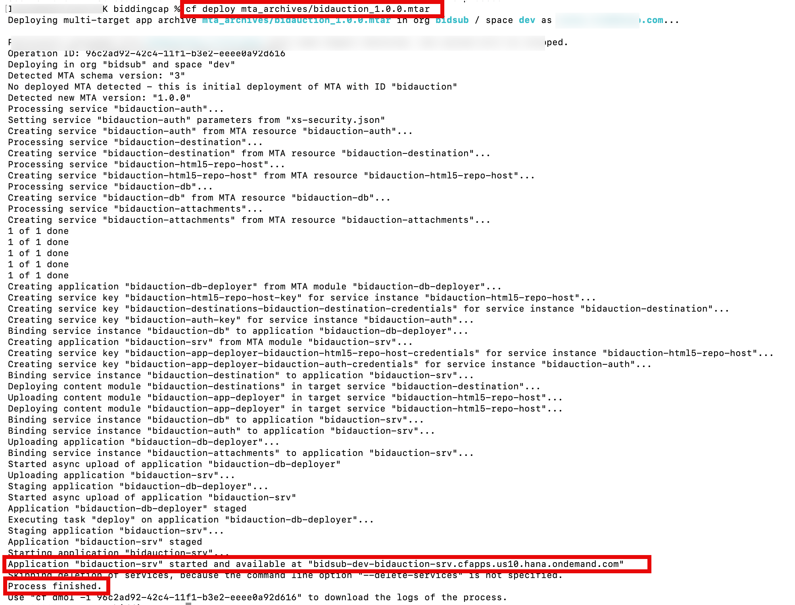

# Build and Deploy the Application to SAP BTP Cloud Foundry

Package the AI-Powered Procurement Bidding Evaluation application as a Multi-Target Application (MTA) archive using the Cloud MTA Build Tool (`mbt`), then deploy it to SAP BTP Cloud Foundry using the CF CLI with the MultiApps plugin — all from the VS Code terminal.

## What You Will Learn

- How to install the required tools: `mbt`, CF CLI, and the MultiApps CF CLI plugin
- How to build the project into an `.mtar` archive using `mbt build`
- How to authenticate and target your Cloud Foundry space from the terminal
- How to deploy the `.mtar` archive to SAP BTP Cloud Foundry using `cf deploy`
- How to verify a successful deployment in the BTP Cockpit

## Prerequisites

- [Node.js](https://nodejs.org/) 18 or higher installed
- [VS Code](https://code.visualstudio.com/) with the **SAP CDS Language Support** extension installed
- A BTP subaccount with Cloud Foundry enabled and a `dev` space provisioned (completed in Step 00)
- HANA Cloud instance and AI Core service key available (completed in Steps 01–02)

---

## Part 1 — Install Required Tools

### Step 1.1 — Install the Cloud MTA Build Tool

The Cloud MTA Build Tool (`mbt`) packages your project into a single `.mtar` archive containing all modules and their dependencies.

Open a terminal in VS Code (**Terminal** → **New Terminal**) and run:

```bash
npm install --global mbt
```

Verify the installation:

```bash
mbt --version
```

You should see output similar to `1.2.x`.

### Step 1.2 — Install Git

Git is required to clone the application source code.

Download and install Git from the [official Git download page](https://git-scm.com/downloads), choosing the installer for your operating system.

Verify the installation:

```bash
git --version
```

Configure your identity (required before making any commits):

```bash
git config --global user.name "Your Name"
git config --global user.email "your.email@example.com"
```

### Step 1.3 — Install the CF CLI

Download and install the Cloud Foundry CLI from the [CF CLI releases page](https://github.com/cloudfoundry/cli/releases/latest), choosing the installer for your operating system.

Verify the installation:

```bash
cf --version
```

### Step 1.4 — Install the MultiApps CF CLI Plugin

The MultiApps plugin extends the CF CLI with the `cf deploy` command, which understands `.mtar` archives.

```bash
cf add-plugin-repo CF-Community https://plugins.cloudfoundry.org
cf install-plugin multiapps
```

When prompted to confirm, enter `y`. Verify the plugin was installed successfully:

```bash
cf plugins | grep multiapps
```

---

## Part 2 — Obtain the Application Source Code

### Step 2.1 — Clone the Repository

Clone the Bidding Evaluation application to your local machine:

```bash
git clone https://github.com/horsemanjackyliu/biddingcap.git
cd biddingcap
```

### Step 2.2 — Review the MTA Deployment Descriptor

The `mta.yaml` file at the project root controls how the application is built and deployed. Before building, verify that the resource names in `mta.yaml` match the service instances in your BTP subaccount.

Open `mta.yaml` in VS Code and check the **resources** section against the table below:

| Resource in `mta.yaml`       | BTP Service / Plan                             |
| ---------------------------- | ---------------------------------------------- |
| `bidauction-db`              | SAP HANA Cloud — `hana` plan                   |
| `bidauction-auth`            | XSUAA — `application` plan                     |
| `bidauction-destination`     | Destination — `lite` plan                      |
| `bidauction-html5-repo-host` | HTML5 Application Repository — `app-host` plan |
| `bidauction-attachments`     | Object Store — `standard` plan                 |

> **Note:** If your service instance names differ from those listed above, update the `resources` section in `mta.yaml` to match the names used in your BTP space before proceeding.

---

## Part 3 — Build the MTA Archive

### Step 3.1 — Run `mbt build`

In the VS Code terminal, make sure you are in the project root (the folder containing `mta.yaml`), then run:

```bash
mbt build
```


The build tool will:

1. Install npm dependencies for each module
2. Compile CDS models
3. Package all modules into a single `.mtar` archive

The process typically takes a few minutes. A successful build ends with output similar to:

```
[2024-xx-xx xx:xx:xx] INFO  MTA archive generated at: mta_archives/bidauction_1.0.0.mtar
```

### Step 3.2 — Verify the Build Output

The generated archive is placed in the `mta_archives/` folder at the project root. You can inspect its contents with any ZIP tool — it will contain one ZIP per module defined in `mta.yaml`.

---

## Part 4 — Log In to Cloud Foundry

### Step 4.1 — Authenticate with the CF CLI

Run the following command, replacing the API URL with the endpoint for your BTP region. You can find your API endpoint on the subaccount **Overview** page under **Cloud Foundry Environment**.

```bash
cf login -a https://api.cf.<region>.hana.ondemand.com
```

Common API endpoints by region:

| Region         | API Endpoint                            |
| -------------- | --------------------------------------- |
| EU (Frankfurt) | `https://api.cf.eu10.hana.ondemand.com` |
| US (East)      | `https://api.cf.us10.hana.ondemand.com` |
| AP (Singapore) | `https://api.cf.ap10.hana.ondemand.com` |

Enter your BTP email and password when prompted, then select your **org** and **space** (`dev`) from the list.

### Step 4.2 — Authenticate with Single Sign-On (SSO)

If your organisation uses SSO, use the `--sso` flag instead:

```bash
cf login -a https://api.cf.<region>.hana.ondemand.com --sso
```

Follow the browser prompt to complete authentication, then return to the terminal to select your org and space.

### Step 4.3 — Confirm the Target

Verify that you are targeting the correct org and space before deploying:

```bash
cf target
```

The output should display your subaccount org and the `dev` space.


---

## Part 5 — Deploy to Cloud Foundry

### Step 5.1 — Run `cf deploy`

Deploy the `.mtar` archive using the MultiApps plugin:

```bash
cf deploy mta_archives/bidauction_1.0.0.mtar
```



> **Tip:** Replace `bidauction_1.0.0.mtar` with the actual filename shown in your `mta_archives/` folder if it differs.

The deployment will:

1. Create any service instances listed in `mta.yaml` that do not already exist in your CF space
2. Deploy and start each application module

This process takes several minutes. Keep the terminal open to monitor progress.

### Step 5.2 — Monitor the Deployment Log

The CF CLI streams the deployment log in real time. A successful deployment ends with:

```
Process finished.
Use "cf dmol -i <process-id>" to download the logs of the process.
```

If the deployment fails, the error message identifies which module or service binding encountered the problem. Use the following command to inspect the application startup logs:

```bash
cf logs <app-name> --recent
```

---

## Part 6 — Verify the Deployment in the BTP Cockpit

1. Open the [SAP BTP Cockpit](https://cockpit.btp.cloud.sap) and navigate to your subaccount.
2. Go to **Cloud Foundry** → **Spaces** → **dev**.
3. Click **Applications**. You should see the deployed modules listed with a **Started** status:

   | Application              | State   |
   | ------------------------ | ------- |
   | `bidauction-srv`         | Started |
   | `bidauction-db-deployer` | Stopped |

   > **Note:** The `db-deployer` application stops automatically after deploying the HANA HDI container schema. This is expected behaviour.

4. To access the application UI, navigate to **HTML5 Applications** in the left-hand menu:


---

## Troubleshooting

| Symptom                                        | Resolution                                                                               |
| ---------------------------------------------- | ---------------------------------------------------------------------------------------- |
| `cf deploy` fails with "not logged in"         | Run `cf login` again — CF sessions expire after 24 hours                                 |
| `mbt build` fails on `npm install`             | Check your Node.js version (`node --version`); it must be ≥ 18                           |
| Service creation fails with "quota exceeded"   | Check entitlements in the BTP Cockpit; confirm all required services are entitled to the subaccount |
| App starts but returns HTTP 502                | Inspect app logs: `cf logs bidauction-srv --recent`                                      |
| HANA deployer fails                            | Confirm the HANA Cloud instance is running and belongs to the same CF space              |

---

## Summary

You have successfully:

- Installed `mbt`, the CF CLI, and the MultiApps CF CLI plugin
- Cloned the application source code and reviewed the MTA descriptor
- Built the application into an `.mtar` archive with `mbt build`
- Authenticated with your BTP Cloud Foundry space using `cf login`
- Deployed the full application stack with `cf deploy`
- Verified the running application in the BTP Cockpit

The application is now live. The backend CAP service (`bidauction-srv`) connects to SAP HANA Cloud for data persistence, to SAP AI Core for bid evaluation inference, and to the S/4HANA Business Partner API via the Destination configured in Step 03.
