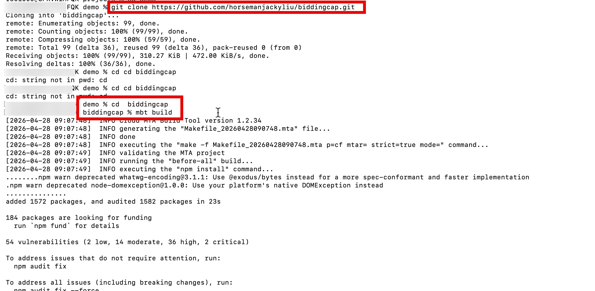
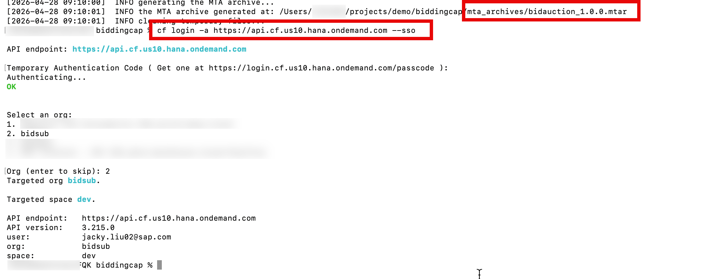
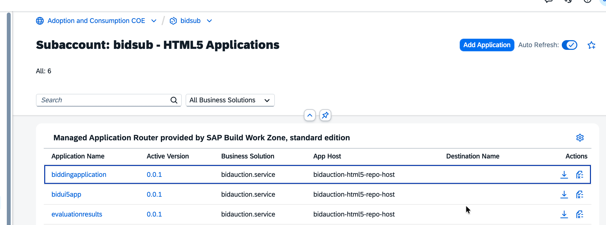

# Build and Deploy the Application to SAP BTP Cloud Foundry

Build the AI-Powered Procurement Bidding Evaluation application as a Multi-Target Application (MTA) archive using the Cloud MTA Build Tool, then deploy it to SAP BTP Cloud Foundry runtime using the CF CLI with the MultiApps plugin — all from VS Code.

## What You Will Learn

- How to install the required tools: Cloud MTA Build Tool (`mbt`), CF CLI, and the MultiApps CF CLI plugin
- How to build the project as an `.mtar` archive using `mbt build`
- How to log in to your Cloud Foundry space from the terminal
- How to deploy the `.mtar` archive to SAP BTP Cloud Foundry using `cf deploy`
- How to verify the deployment in the BTP Cockpit

## Prerequisites

- [Node.js](https://nodejs.org/) 18 or higher installed
- [VS Code](https://code.visualstudio.com/) with the **SAP CDS Language Support** extension installed
- The application source code cloned and opened in VS Code
- A BTP subaccount with Cloud Foundry enabled and a `dev` space provisioned (completed in Step 00)
- HANA Cloud instance and AI Core service key available (completed in Steps 01–02)

---

## Part 1 — Install Required Tools

### Step 1.1 — Install the Cloud MTA Build Tool

The Cloud MTA Build Tool (`mbt`) packages your project into an `.mtar` archive that contains all modules and their dependencies.

Open a terminal in VS Code (**Terminal** → **New Terminal**) and run:

```bash
npm install --global mbt
```

Verify the installation:

```bash
mbt --version
```

You should see a version number such as `1.2.x`.

### Step 1.2 — Install Git

Git is required to clone the application source code repository.

Download and install Git from the [official download page](https://git-scm.com/downloads). Choose the installer for your operating system.

After installation, verify it works:

```bash
git --version
```

Configure your identity (required for any commits):

```bash
git config --global user.name "Your Name"
git config --global user.email "your.email@example.com"
```

### Step 1.3 — Install the CF CLI

Download and install the Cloud Foundry CLI from the [official releases page](https://github.com/cloudfoundry/cli/releases/latest). Choose the installer for your operating system.

After installation, verify it works:

```bash
cf --version
```

### Step 1.4 — Install the MultiApps CF CLI Plugin

The MultiApps plugin adds the `cf deploy` command that understands `.mtar` archives.

```bash
cf add-plugin-repo CF-Community https://plugins.cloudfoundry.org
cf install-plugin multiapps
```

When prompted to confirm installation, enter `y`. Verify the plugin is installed:

```bash
cf plugins | grep multiapps
```

---

## Part 2 — Review the MTA Deployment Descriptor

### Step 2.1 Download Bidding Evaluation application with the following command:

```bash
git clone https://github.com/horsemanjackyliu/biddingcap.git
cd biddingcap
```

### Step 2.2 Check MTA file:

The `mta.yaml` file in the project root controls how the application is built and deployed. Before building, confirm the file references the correct service names that match your BTP subaccount configuration.

Open `mta.yaml` in VS Code and review the **resources** section. The key services should match:

| Resource name in `mta.yaml`  | BTP service / plan                             |
| ---------------------------- | ---------------------------------------------- |
| `bidauction-db`              | SAP HANA Cloud — `hana` plan                   |
| `bidauction-auth`            | XSUAA — `application` plan                     |
| `bidauction-destination`     | Destination — `lite` plan                      |
| `bidauction-html5-repo-host` | HTML5 Application Repository — `app-host` plan |
| `bidauction-attachments`.    | objectstore - `standard` plan                  |

> If your service instance names differ, update the `mta.yaml` resources section to match the names used in your BTP space.

---

## Part 3 — Build the MTA Archive

### Step 3.1 — Run `mbt build`

In the VS Code terminal, navigate to the project root (the folder containing `mta.yaml`) and run:

```bash
mbt build
```



The build tool will:

1. Install npm dependencies for each module
2. Compile CDS models
3. Package all modules into a single `.mtar` archive

The process takes a few minutes. A successful build ends with output similar to:

```
[2024-xx-xx xx:xx:xx] INFO  MTA archive generated at: mta_archives/procurement-bid-eval_1.0.0.mtar
```

### Step 3.2 — Verify the Output

The archive is placed in the `mta_archives/` folder at the project root. You can inspect its contents with any ZIP tool — it will contain one ZIP per module defined in `mta.yaml`.

---

## Part 4 — Log In to Cloud Foundry

### Step 4.1 — Set the API Endpoint and Log In

Run the following command, replacing the API URL with the one for your BTP region (find it in your subaccount **Overview** page under **Cloud Foundry Environment**):

```bash
cf login -a https://api.cf.<region>.hana.ondemand.com
```

Common API endpoints:

| Region         | API Endpoint                            |
| -------------- | --------------------------------------- |
| EU (Frankfurt) | `https://api.cf.eu10.hana.ondemand.com` |
| US (East)      | `https://api.cf.us10.hana.ondemand.com` |
| AP (Singapore) | `https://api.cf.ap10.hana.ondemand.com` |

Enter your BTP email and password when prompted. Then select your **org** and **space** (`dev`) from the list.

### Step 4.2 — Confirm the Target

Verify you are targeting the correct org and space:

```bash
cf target
```

The output should show your subaccount org and the `dev` space.

If the the tauget is not the correct subaccount org and dev space, use the following command to login and select the correct subaccount and development space

```
cf login -a https://api.cf.<data center like us10>.hana.ondemand.com --sso
```



---

## Part 5 — Deploy to Cloud Foundry

### Step 5.1 — Run `cf deploy`

Deploy the `.mtar` archive using the MultiApps plugin:

```bash
cf deploy mta_archives/bidauction_1.0.0.mtar
```


> Replace `mta_archives/bidauction_1.0.0.mtar` with the actual filename shown in your `mta_archives/` folder.

The deployment creates all service instances listed in the `resources` section of `mta.yaml` (if they do not already exist), then deploys and starts each application module. This takes several minutes.

### Step 5.2 — Monitor the Deployment Log

The terminal streams the deployment log in real time. A successful deployment ends with:

```
Process finished.
Use "cf dmol -i <process-id>" to download the logs of the process.
```

If the deployment fails, the error message identifies which module or service binding failed. Run `cf logs <app-name> --recent` to inspect application startup logs.

---

## Part 6 — Verify the Deployment in the BTP Cockpit

1. Open the [SAP BTP Cockpit](https://cockpit.btp.cloud.sap) and navigate to your subaccount.
2. Go to **Cloud Foundry** → **Spaces** → **dev**.
3. Click **Applications**. You should see the deployed modules listed, for example:

   | Application              | State   |
   | ------------------------ | ------- |
   | `bidauction-srv`         | Started |
   | `bidauction-db-deployer` | Started |

   > The `db-deployer` application stops automatically after deploying the HANA HDI container schema — this is expected behaviour.

4. Go to **HTML5 Applications**



---

## Troubleshooting

| Symptom                                      | Resolution                                                                             |
| -------------------------------------------- | -------------------------------------------------------------------------------------- |
| `cf deploy` fails with "not logged in"       | Run `cf login` again — CF sessions expire daily                                        |
| `mbt build` fails on `npm install`           | Check Node.js version (`node --version`); must be ≥ 18                                 |
| Service creation fails with "quota exceeded" | Check entitlements in BTP Cockpit; confirm all services are entitled to the subaccount |
| App starts but returns 502                   | Check app logs: `cf logs procurement-bid-eval-srv --recent`                            |
| HANA deployer fails                          | Confirm the HANA Cloud instance is running and in the same CF space                    |

---

## Summary

You have:

- Installed `mbt`, the CF CLI, and the MultiApps CF CLI plugin
- Built the application into an `.mtar` archive using `mbt build`
- Logged in to your BTP Cloud Foundry space with `cf login`
- Deployed the full application stack with `cf deploy`
- Verified the running application in the BTP Cockpit

The application is now accessible via its app-router URL. The backend CAP service (`-srv`) connects to SAP HANA Cloud for persistence, to SAP AI Core for bid evaluation inference, and to the S/4HANA Business Partner API via the Destination configured in Step 03.
