# Configure SAP Build Work Zone to Embed the Procurement Bidding Applications

Create a Work Zone site and embed the three Fiori applications — **Bidding Application**, **BID Management Application**, and **Evaluation Results** — that were deployed to the HTML5 Application Repository in Step 04.

## What You Will Learn

- How to open the SAP Build Work Zone Site Manager from the BTP Cockpit
- How to create a site and enable the Spaces and Pages — New Experience layout
- How to refresh the HTML5 Apps content channel so the deployed apps are discoverable
- How to use the Content Explorer to import all three apps in one step
- How to assign the apps to the `Everyone` role for universal access
- How to build a page, add the three app tiles, and organise the page inside a space
- How to verify the finished site and launch an application at runtime

## Prerequisites

- SAP Build Work Zone, standard edition is subscribed in your BTP subaccount and the `Launchpad_Admin` role collection is assigned to your user (completed in Step 00)
- The three Fiori applications are deployed and visible under **HTML5 Applications** in the BTP Cockpit (completed in Step 04)

---

## Part 1 — Open the Work Zone Site Manager

1. In the [SAP BTP Cockpit](https://cockpit.btp.cloud.sap), navigate to your subaccount.
2. Go to **Services** → **Instances and Subscriptions**.
3. Under **Subscriptions**, click on **SAP Build Work Zone, standard edition** to expand its details, then click **Go to Application**.

   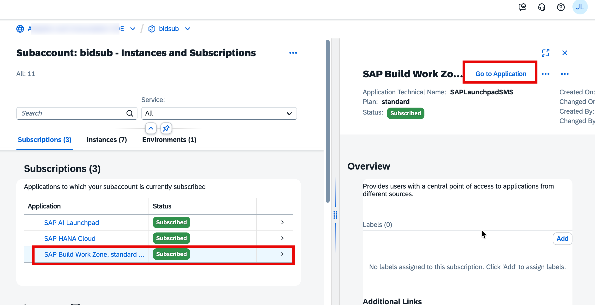

The **Site Directory** opens. This is the central administration hub for all Work Zone sites.

---

## Part 2 — Create a New Site

### Step 2.1 — Create the Site

In the Site Directory, click **Create Site**.

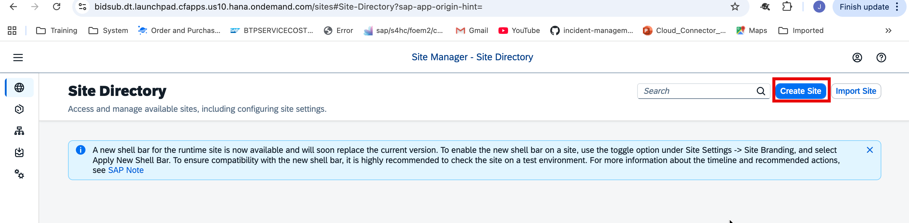

In the **Create Site** dialog, enter `Procurement Bidding` as the site name and click **Create**.

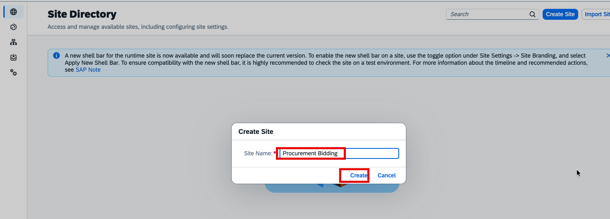

### Step 2.2 — Enable Spaces and Pages — New Experience

After the site is created, you are taken directly to the **Site Settings** screen. You need to switch the view mode to the modern Spaces and Pages layout.

1. Click **Edit** in the top-right corner of the screen.

   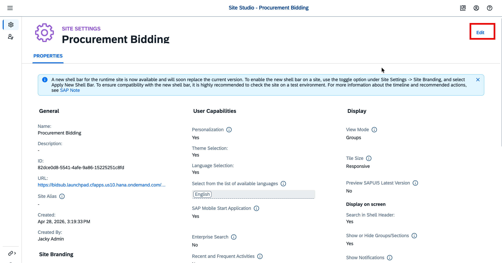

2. Under **Display** → **View Mode**, select **Spaces and Pages - New Experience**.

   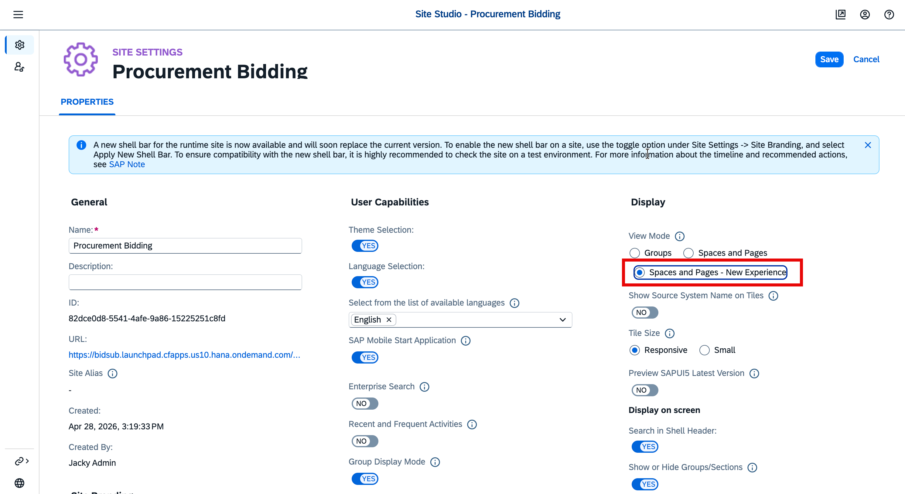

3. Click **Save**.

   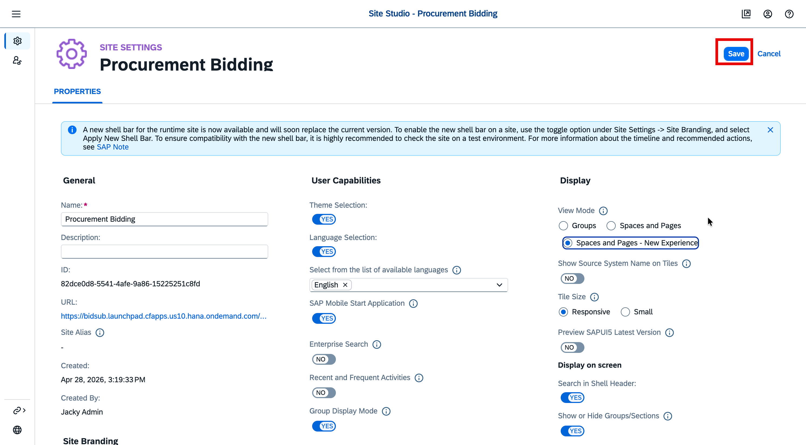

4. Click **Go to Site Directory** at the bottom-left of the screen to return to the Site Directory.

   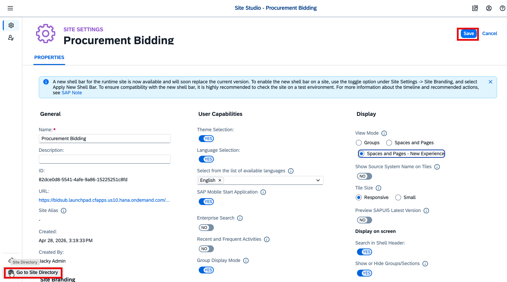

Your `Procurement Bidding` site tile now appears in the Site Directory. The site is empty — you will add the three apps in the following parts.

---

## Part 3 — Refresh the HTML5 Apps Content Channel

Before importing apps, update the HTML5 Apps channel so it reflects the latest state of the HTML5 Application Repository.

1. Click the **Channel Manager** icon (third icon) in the left-side panel.
2. In the **HTML5 Apps** row, click the **Refresh** icon (circular arrow) in the **Actions** column.

   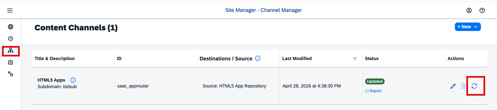

Wait until the **Status** column shows **Updated** before proceeding.

---

## Part 4 — Import the Apps via Content Explorer

The Content Explorer lets you browse the HTML5 Application Repository and add all three apps to your site in a single operation — no manual app configuration required.

### Step 4.1 — Open the Content Manager

Click the **Content Manager** icon (second icon) in the left-side panel. In the Content Manager, click **Content Explorer**.

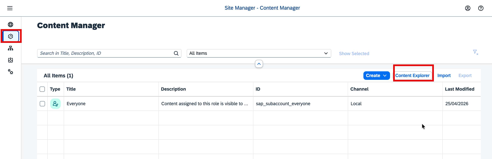

### Step 4.2 — Select the HTML5 Apps Channel

The Content Explorer shows available content channels. Click the **HTML5 Apps** tile.

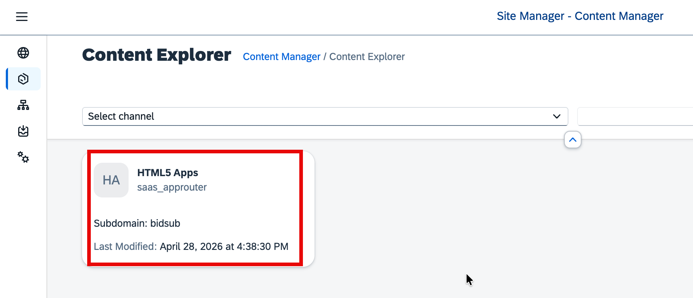

### Step 4.3 — Add All Three Applications

The channel lists the three Fiori apps deployed in Step 04:

| App | ID |
| --- | --- |
| BID Management Application | `bidui5app` |
| Evaluation Results | `evaluationresults` |
| Bidding Application | `biddingapplication` |

Tick the header checkbox to select all three apps, then click **Add**.

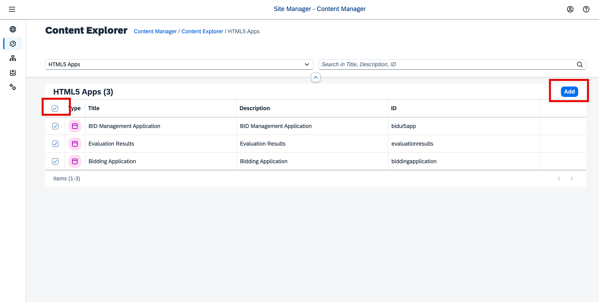

### Step 4.4 — Verify the Apps Appear in the Content Manager

Navigate back to the **Content Manager** using the breadcrumb at the top. You should now see all three apps listed alongside the built-in `Everyone` role — **All Items (4)** in total.

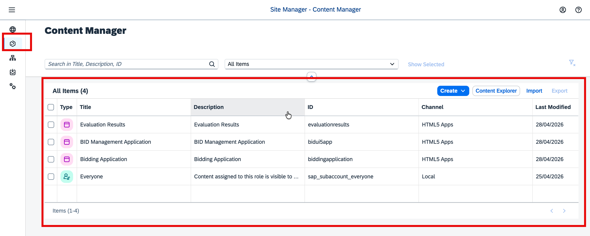

---

## Part 5 — Assign the Apps to the Everyone Role

For end users to see the app tiles at runtime, each app must be assigned to a role. The built-in `Everyone` role makes content visible to all authenticated users.

1. In the Content Manager, click the **Everyone** role.

   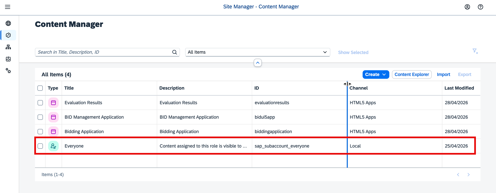

2. Click **Edit**.

   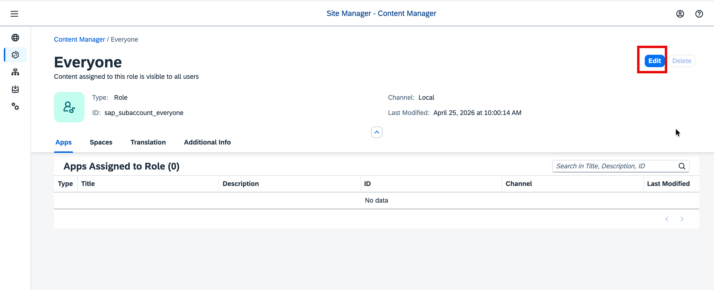

3. Under the **Apps** tab, all three apps are listed. Click the toggle in the **Assignment Status** column for each app to turn it green.

4. Click **Save**.

   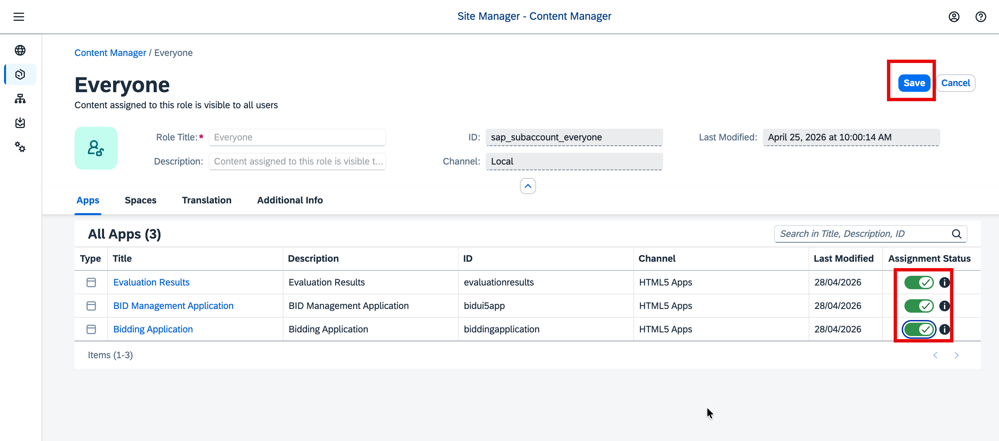

---

## Part 6 — Build a Page with the Three App Tiles

### Step 6.1 — Create a Page

1. In the Content Manager, click **Create** → **Page**.

   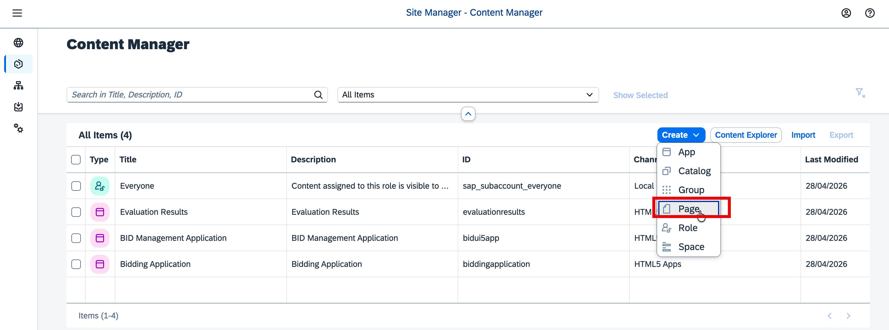

2. Enter `Procurement Overview` as the **Page Title**, then click **Add section**.

   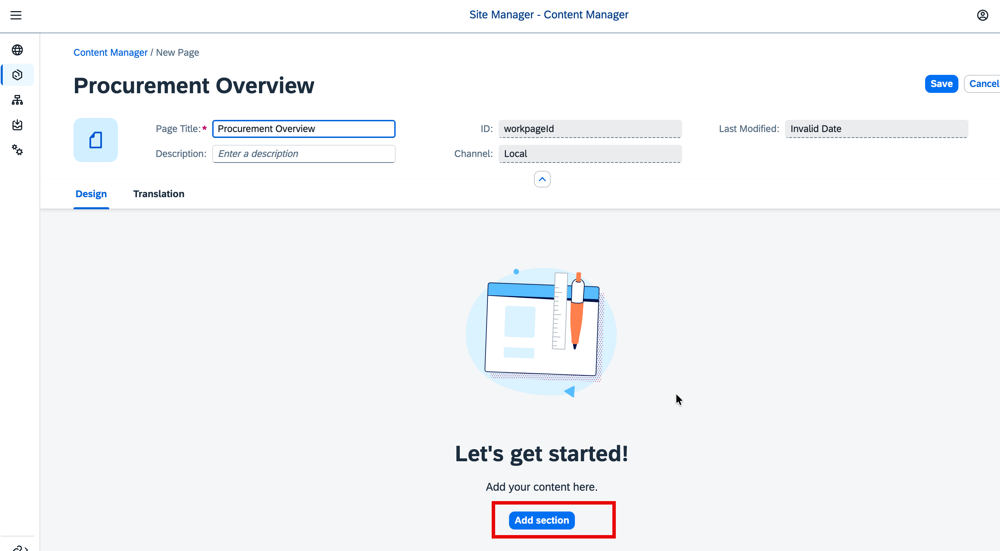

### Step 6.2 — Add a Section and Select the Apps

1. Enter `Bidding Applications` as the section **Header**, then click **Add Widget**.

   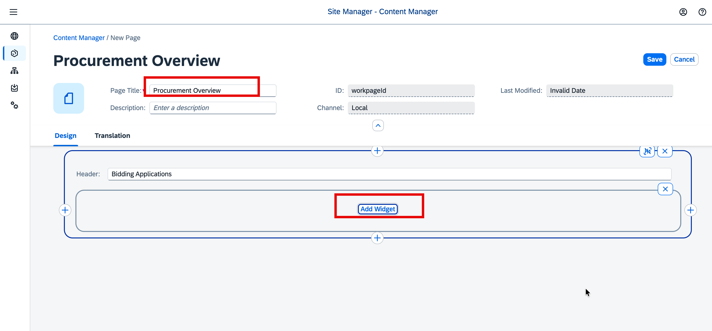

2. In the **Add Apps** dialog, tick all three app tiles — **Bidding Application**, **BID Management Application**, and **Evaluation Results** — then click **Add (3)**.

   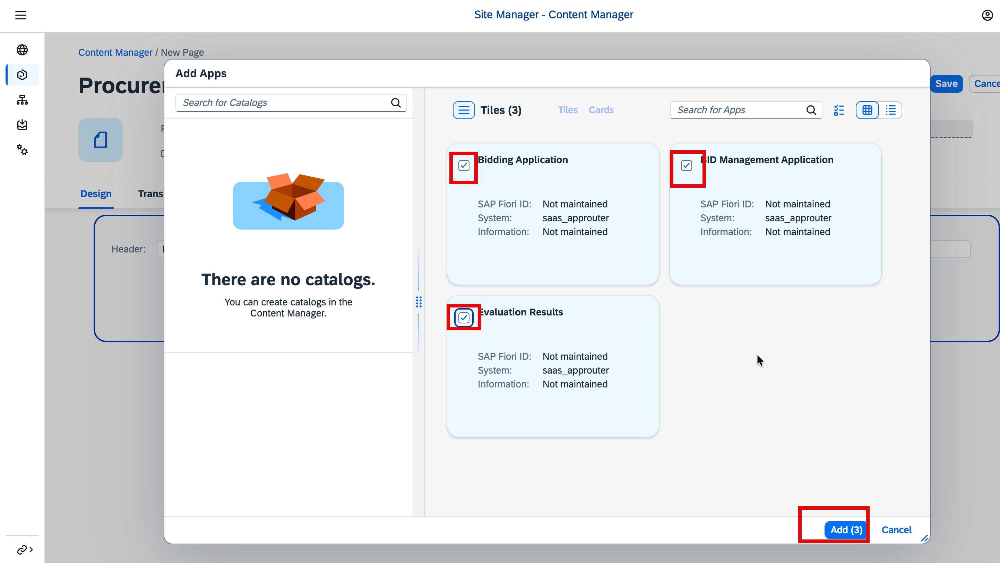

### Step 6.3 — Save the Page

Click **Save**. The page now shows all three app tiles arranged side by side in the **Bidding Applications** section.

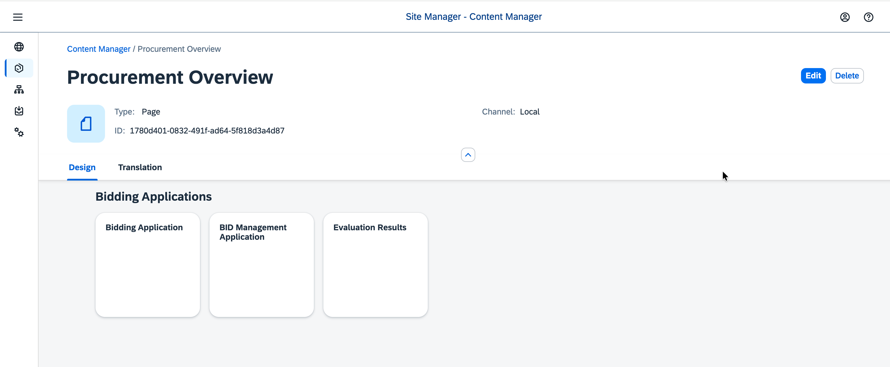

Use the breadcrumb at the top (**Content Manager / Procurement Overview**) to return to the Content Manager.

---

## Part 7 — Create a Space and Assign the Page

Spaces group pages under a named navigation tab that users see in the site header.

### Step 7.1 — Create a Space

1. In the Content Manager, click **Create** → **Space**.

   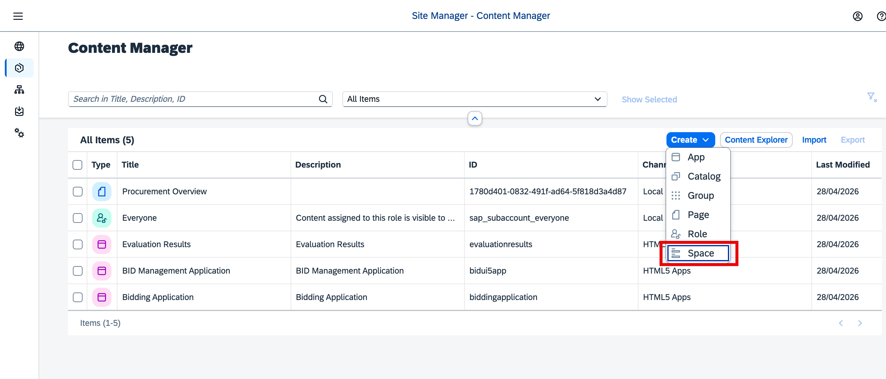

2. Enter `Procurement` as the **Space Title**.

3. Under the **Pages** tab, click the **Assignment Status** toggle next to `Procurement Overview` to assign the page to this space.

4. Click **Save**.

   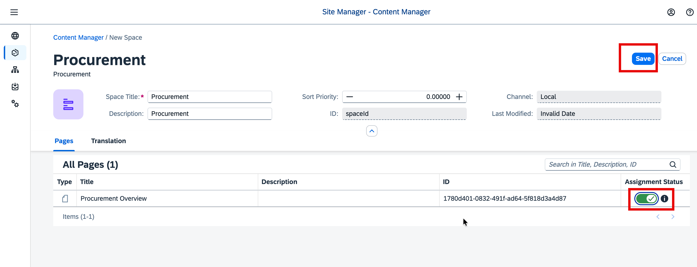

### Step 7.2 — Assign the Space to the Everyone Role

1. In the Content Manager, click the **Everyone** role. You should now see six items in the list — all three apps, the page, and the space.

   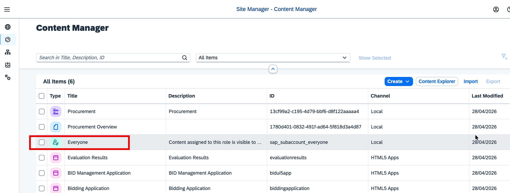

2. Click **Edit**.

3. Click the **Spaces** tab. Toggle the **Assignment Status** of the `Procurement` space to green.

4. Click **Save**.

   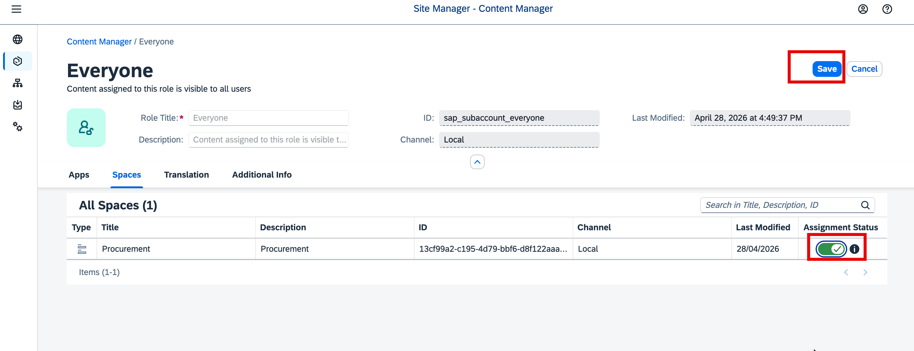

---

## Part 8 — Launch and Verify the Site

1. Click the **Site Directory** icon (first icon) in the left-side panel.
2. On the **Procurement Bidding** tile, click the **Go to Site** icon (the small launch icon at the bottom of the tile).

   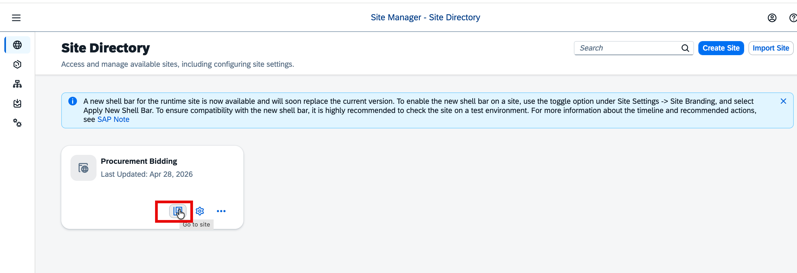

3. The site opens in a new browser tab. Under the **Procurement** space tab, navigate to the **Procurement Overview** page. You should see the three app tiles in the **Bidding Applications** section.

   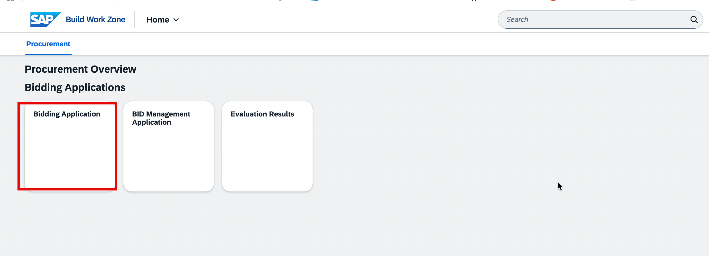

4. Click the **Bidding Application** tile to open the application. The Fiori list view loads inside Work Zone.

   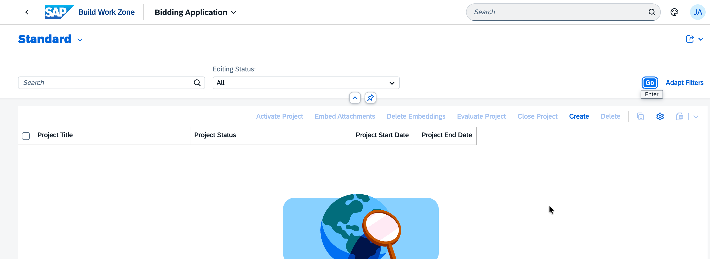

---

## Troubleshooting

| Symptom | Resolution |
| ------- | ---------- |
| Apps do not appear in the Content Explorer | Confirm the MTA deployment in Step 04 completed successfully and refresh the HTML5 Apps channel in the Channel Manager |
| Content Explorer shows the HTML5 Apps channel but it is empty | The `bidauction-html5-repo-host` service instance may not have been created; verify it exists under **Instances** in the BTP Cockpit |
| App tiles appear but fail to load with a 403 error | Confirm all three apps are toggled green under the **Apps** tab of the `Everyone` role |
| The Procurement space does not appear in the runtime site | Confirm the `Procurement` space is toggled green under the **Spaces** tab of the `Everyone` role |
| Site settings do not show Spaces and Pages — New Experience | Ensure you clicked **Edit** before changing the View Mode, and that you clicked **Save** afterwards |

---

## Summary

You have successfully:

- Created the **Procurement Bidding** Work Zone site with Spaces and Pages — New Experience enabled
- Refreshed the HTML5 Apps content channel to make the deployed apps discoverable
- Imported all three Fiori apps from the HTML5 Application Repository via the Content Explorer
- Assigned all three apps to the `Everyone` role for universal access
- Built a **Procurement Overview** page containing the three app tiles in a **Bidding Applications** section
- Organised the page under a **Procurement** space and made it accessible to all users

All three applications — **Bidding Application**, **BID Management Application**, and **Evaluation Results** — are now accessible as tiles on the Work Zone launchpad.
